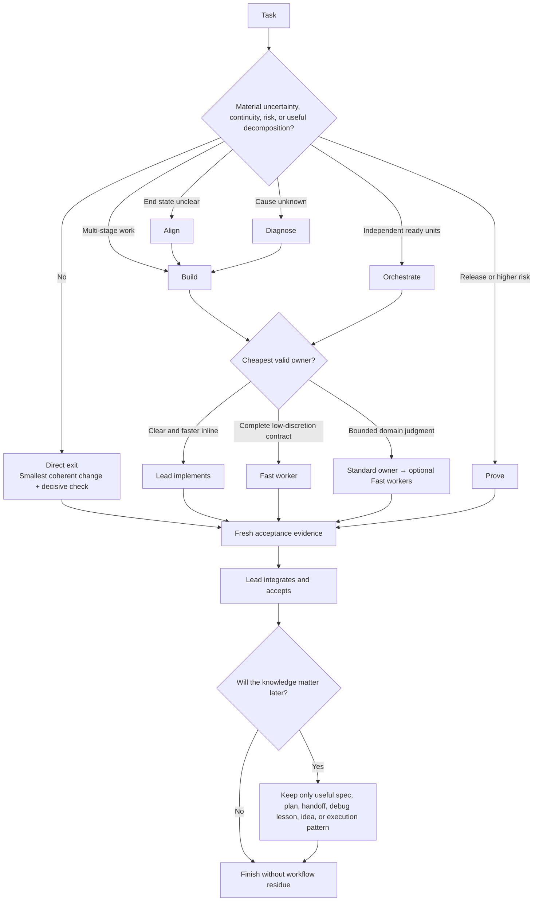

<p align="center">
  
</p>

<h1 align="center">Goldilocks</h1>

<p align="center"><strong>Not too much process. Not too little rigor. Just right.</strong></p>

<p align="center">
  <a href="README.md">English</a> · <a href="README.zh-CN.md">简体中文</a>
</p>

<p align="center">
  
  
  <a href="https://skills.sh/blackstone2333/goldilocks/goldilocks"></a>
  
</p>

Goldilocks is a lean, adaptive replacement for Superpowers and a token-efficient AI agent workflow for Codex, Claude Code, and other Skills-compatible agents. It keeps the workflow capabilities that protect project quality—brainstorming, specifications, plans, TDD, debugging, continuity, delegation, review, verification, and idea capture—behind one visible Skill.

In the v0.4.1 certified Direct A/B, both paths passed 114/114 external checks while Goldilocks used 11.5% fewer processing tokens and 10.9% less cumulative time; official GPT-5.6 Sol Standard token cost was 6.3% lower. These are measured results on the tested coding fixtures, not a claim of universal superiority.

> Use the minimum process that preserves the quality, safety, authorization, and acceptance floor.

Clear work stays Direct. Structure appears only when a concrete trigger earns it. Lead models spend their scarce context on intent, architecture, integration, and final acceptance; cheaper workers receive complete, independently verifiable contracts.

Goldilocks is domain-agnostic: any executable work may enter the router, including software, research, analysis, documents, presentations, spreadsheets, and other structured deliverables. It chooses how much workflow and coordination the task earns; specialist Skills still own domain-specific production. When decomposition is worthwhile, unit boundaries keep rework local. Short or inseparable creative work may therefore remain entirely Direct.

## Install

Do not enable Goldilocks and Superpowers together.

### Ask an AI to install it

Copy this entire prompt into Codex, Claude Code, Cursor, or another agent that can manage its own Skills or plugins:

```text
Install the latest Goldilocks from https://github.com/blackstone2333/goldilocks. Detect this agent's platform first: prefer the native plugin installation documented in the repository when supported; otherwise install Goldilocks globally as a compatible Skill. Do not enable Goldilocks and Superpowers together. Before any Hook approval, explain what the requested Hooks do and ask me to confirm; do not approve unrelated permissions. After installation, verify the installed version and availability, then tell me whether a new conversation is required. Do not modify unrelated configuration.
```

### Any Skills-compatible agent

```bash
npx skills add blackstone2333/goldilocks
```

For a global Codex Skill install:

```bash
npx skills add blackstone2333/goldilocks --skill goldilocks --global --agent codex --yes
```

Replace `codex` with `claude-code`, `cursor`, `opencode`, `github-copilot`, or `gemini-cli` when supported by the installer.

### Native Codex plugin

```bash
codex plugin marketplace add blackstone2333/goldilocks
codex plugin add goldilocks@goldilocks-local
```

#### Hook authorization is expected

The native Codex plugin contains local command Hooks, so Codex asks for approval on first install and may ask again after an update, reinstall, or plugin-cache refresh. This is Codex re-establishing trust for an installed executable bundle; it does **not** mean Goldilocks damaged the installation.

- `recovery_reminder.py` gives executable prompts a tiny Goldilocks gate before specialist Skills, escalates repeated failures into durable continuity, restores compacted state, and adds the concise response contract. Its local audit stores hashes, bounded recurrence flags, and timestamps—never prompt text.
- `agent_routing_guard.py` checks subagent routing and stores routing metadata locally in the plugin data directory.
- `update_checker.py` checks only the Goldilocks manifest on GitHub, at most once per day. It never installs an update or changes project files. Set `GOLDILOCKS_UPDATE_CHECK=0` to disable this network check.

If Hook approval is declined, the Skill can still provide its written workflow, but automatic continuity reminders, routing enforcement, and update notices will not run. Review the exact commands in [`hooks/hooks.json`](plugins/goldilocks/hooks/hooks.json) before approving if desired.

### Native Claude Code plugin

```bash
claude plugin marketplace add blackstone2333/goldilocks
claude plugin install goldilocks@goldilocks
```

See the [installation guide](docs/installation.md) for project-local installs, updates, and removal.

### Updates

Repository and skills.sh installs follow the GitHub source but do not silently rewrite an active local copy. Run the matching install or upgrade command again to pick up a release. The native Codex plugin performs one quiet GitHub version check per day, stays silent when current or offline, and shows one reminder for a newer version; it never updates itself without approval. Set `GOLDILOCKS_UPDATE_CHECK=0` to disable the check.

## What it does

| Internal engine | Activated when | Result |
|---|---|---|
| **Align** | The end state, product choice, authority, or acceptance is materially unclear | A compact decision or spec before implementation |
| **Diagnose** | A failure exists but its cause is unknown | Reproduction, traced cause, focused fix, regression evidence |
| **Build** | Work needs reuse decisions, a durable plan, execution stages, or deliberate TDD | The smallest useful plan and coherent implementation units |
| **Orchestrate** | Worktrees, independent units, delegation, parallelism, or model routing can improve delivery | A ready dependency graph and bounded worker contracts |
| **Prove** | Review, release, safety, integration, or several material claims need evidence | Fresh checks proportional to risk and Lead acceptance |
| **Evolve** | A useful new idea, reusable execution pattern, or Skill improvement appears | Deferred idea or verified lesson without scope creep |

These are internal workflow engines, not six separate public Skills. The single `goldilocks` router loads only the relevant engine and adds another only when facts cross its boundary.

## How it decides



The invariant is final quality, not process volume or who typed the code. Goldilocks will not create a spec, plan, worktree, subagent, or continuity file merely because one exists in the toolkit.

## Direct by default

The root router is under 300 words. If there is no material decision, unknown cause, continuity need, external risk, or useful ready work to delegate, Goldilocks exits before loading a workflow reference. It inspects task-local facts, makes the smallest coherent change, and runs the smallest check that would fail if the result were wrong.

An existing hook adds a 26-word communication contract inspired by Caveman and i-have-adhd (ADHD): result first, no work preamble, changed state only, short decisive logs, and full wording whenever safety or ambiguity requires it. It reduces narration without turning the agent into a caveman persona or suppressing necessary evidence.

The same Hook now places a compact zero-cost gate before specialist Skills. Pure conversation skips it; clear executable work stays Direct without loading the full router; material uncertainty, unknown cause, multi-stage continuity, or useful decomposition explicitly loads `goldilocks:goldilocks`. A local audit records only prompt and workspace hashes, session/turn identifiers, and timestamps so activation can be verified without retaining prompt content.

Repeated failures earn persistence without turning every task into paperwork. On the second user-confirmed recurrence in the same session and workspace, Goldilocks requires one live `.goldilocks/ACTIVE.md` frontier plus the project's existing debug or validation record. Symptom, evidence, disproven attempts, **Do not repeat**, the exact next test, and related commits survive compaction. Unverified fixes stay out of the changelog; only freshly verified user-visible release changes enter it. Resume and compaction hooks recover unresolved continuity debt even if the frontier was not created on the previous turn.

## Continuity without document spam

Direct work does not create workflow documents by default, but models remain free to create documentation when documentation is the deliverable or correctness requires it. Durable state begins only when work must survive compaction, several stages, waiting, steering, delegation, or handoff.

When useful, Goldilocks keeps a clean, human-readable project memory:

```text
docs/
├── PROJECT.md          # project map and stable structure
├── work/               # active specs, plans, work packets, handoffs
├── debug/              # recurring bugs, causes, fixes, regression links
├── ideas.md            # valuable ideas outside the current scope
└── CHANGELOG.md        # user-visible changes
.goldilocks/
└── ACTIVE.md           # compact execution frontier for recovery
```

`ACTIVE.md` records completed work, the exact next action, pending or consumed steering, repository evidence, verification, and the do-not-repeat boundary. After compaction, repository state wins over stale memory. Verified execution patterns may be reused on a similar task only after their invalidators are checked.

## Company-style delegation

Goldilocks treats delegation as an economic and organizational decision:

- **Lead** owns user intent, architecture, shared decisions, conflicts, integration, and final acceptance.
- **Standard** owns a bounded domain where judgment remains and may turn its decisions into Fast contracts.
- **Fast** receives a complete contract with scope, authority, inputs, interfaces, acceptance, and return evidence. Fast is a leaf.

Fast means low residual discretion after decomposition, not a small original task. Several independent ready units may run in parallel; one inseparable core stays with Lead. Worker count is limited by dependencies, host capacity, isolation, integration risk, and reviewer throughput—not by an arbitrary project-size tier.

### Codex model routes

**Coding → Spark · General → Luna**

- Fast **coding** starts with `gpt-5.3-codex-spark`, especially when its separately metered Codex channel lowers opportunity cost.
- Fast **general non-coding** starts with `gpt-5.6-luna` for bounded copy, summaries, content units, and similar work.
- Standard and Lead use the best available model that clears the task-specific quality floor; local evidence overrides the seed registry.

Goldilocks prefers a native, explicitly supported host model. When native Spark or Luna is unavailable but the local Codex CLI exposes it, `dispatch_codex_worker.py` uses `codex exec` with the chosen model and a complete contract. The default `project` profile preserves repository rules while isolating unrelated global plugins, Apps, MCP servers, Skills, and Hooks. Explicit `inherit` is available when a contract names a required user capability. Fast loses delegation authority, not ordinary execution tools.

Delegation begins only on a verified route. A route startup failure returns to Direct or another already proven route instead of spending a Lead turn diagnosing worker transport inside the product task. Child event streams can remain outside Lead context while concise evidence flows upward.

The objective is not the lowest raw token count at any cost. Quality and authority are hard gates; total tokens stay bounded; among valid routes Goldilocks minimizes scarce high-multiplier usage and critical-path time.

The initial model seed is advisory, not a permanent leaderboard:

| Role | Starting candidates | Boundary |
|---|---|---|
| Fast coding | GPT-5.3-Codex-Spark; Muse Spark; GLM; other verified low-cost coding models | Complete contract, deterministic acceptance, no shared decisions |
| Fast general | GPT-5.6 Luna; other verified general-production models | Bounded content unit, no final editorial or visual judgment |
| Standard | GPT-5.6 Terra; Grok; Claude Sonnet; Gemini Pro; GLM/Qwen candidates | Bounded domain judgment and local integration |
| Lead | Current host Lead model such as GPT-5.6 Sol; Claude Opus/Fable; other verified frontier models | Intent, architecture, critical decisions, combined acceptance |

Availability, tools, privacy, language, modality, and task-specific quality are hard gates. Recent results on the same repository and task shape override public rankings. See the [machine-readable registry](plugins/goldilocks/skills/goldilocks/assets/model-registry.json) and [dated methodology](docs/model-routing-survey-2026-07-18.md).

## Evidence

### v0.4.1 Direct-path certification

Fresh repositories, hidden deterministic acceptance, simultaneous Direct/Goldilocks waves, excluded warm-ups, and GPT-5.6 Sol at high reasoning were used for simple, moderate, and complex coding fixtures.

| Scenario | Runs per arm | Acceptance per arm | Median time | Median official API cost | Median processing tokens |
|---|---:|---:|---:|---:|---:|
| Simple | 3 | 9/9 | **−2.6%** | **−24.3%** | **−13.8%** |
| Moderate | 5 | 60/60 | **−30.1%** | **−13.6%** | **−20.4%** |
| Complex | 3 | 45/45 | **−4.2%** | **−4.9%** | **−14.5%** |

Across all eleven runs per arm, both paths passed **114/114** external checks. Goldilocks used 10.9% less cumulative time, 6.3% less official GPT-5.6 Sol Standard token cost, and 11.5% fewer processing tokens. This certifies the tested Direct branch; broader discovery, debugging, continuity, and delegation still benefit from more real-project feedback. Read the [report and machine-readable data](evals/results/2026-07-26-v041-direct-depth-ab.md).

### Goldilocks vs Superpowers

Goldilocks makes a narrow public claim: it is a better Superpowers replacement on the tested workflow surface.

| Evaluation | Goldilocks | Superpowers | Result |
|---|---:|---:|---|
| Eight-scenario instruction stress test | **98.9/100** | 79.2/100 | Goldilocks led 8/8 with 86.2% less rule text |
| Three Bears successful deliveries | **27/27** | 8/27 | Goldilocks preserved 100% measured safety |
| Cost per successful delivery, total tokens | **112,285** | 289,333 | Goldilocks −61.2% |
| Cost per successful delivery, time | **143.2 s** | 361.3 s | Goldilocks −60.4% |
| Cost per successful delivery, Skill activity | **1.1** | 10.9 | Goldilocks −89.8% |

On the eight exact cells both workflows completed, Goldilocks used 30.6% fewer total tokens, 7.7% less time, 28.6% fewer tool calls, and 66.7% less Skill activity. Read the [full head-to-head report](benchmarks/GOLDILOCKS-VS-SUPERPOWERS.md) and [published data](benchmarks/three_bears/results/data/2026-07-18-terra-low-full/head-to-head.json).

These results support replacing Superpowers; they do not establish absolute superiority across every possible workflow, model, repository, or provider. More project tests and feedback are welcome.

## Status

Goldilocks remains experimental at `v0.4.4`. It can better replace Superpowers, but it does not have an absolute advantage in every possible workflow. More project testing and feedback are needed, and [issues and suggestions are welcome](https://github.com/blackstone2333/goldilocks/issues).

Goldilocks is MIT licensed and developed by Charles Roc and contributors. It is an independent implementation influenced by Superpowers, Grill-style decision-frontier questioning, Ponytail's native/reuse-first approach, Caveman, and ADHD. Those projects do not endorse Goldilocks. See [Third-Party Notices](plugins/goldilocks/THIRD_PARTY_NOTICES.md).
