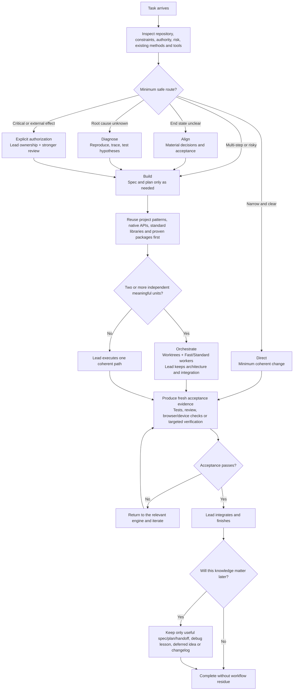

<p align="center">
  
</p>

<h1 align="center">Goldilocks</h1>

<p align="center"><strong>Not too much process. Not too little rigor. Just right.</strong></p>

<p align="center">
  <a href="README.md">English</a> · <a href="README.zh-CN.md">简体中文</a>
</p>

<p align="center">
  
  
  <a href="https://skills.sh/blackstone2333/goldilocks/goldilocks"></a>
  
</p>

Goldilocks is a Codex workflow plugin built around the **Just-Necessary Principle**:

> Use the minimum process that preserves a constant quality, safety, authorization, and verification floor.

It provides a Superpowers-compatible workflow surface without requiring every task to pay for the entire workflow stack. Brainstorming, plans, TDD, debugging, worktrees, delegation, review, verification, branch finishing, and skill authoring remain available; each is loaded only when the task earns it.

## Why Goldilocks

- **Dynamic depth:** Direct, Fast, Lead, and Critical work receive different amounts of process while keeping the same acceptance standard.
- **Progressive disclosure:** thirteen compatibility entries route into six shared engines instead of duplicating fourteen long procedures.
- **Native and reuse first:** inspect the project, standard library, established helpers, and proven libraries before inventing new machinery.
- **Decision-frontier questions:** ask only when an answer can materially change the end state, safety, scope, or authorization.
- **Ideas without scope creep:** useful adjacent ideas are preserved for later rather than silently expanding the current task.
- **Evidence before completion:** confidence, old test output, and agent reports never replace fresh evidence for material claims.
- **Parallel when earned:** after planning, independent meaningful units default to capable workers while the Lead keeps architecture, review, and integration.
- **Model value routing:** task-specific quality gates come before price; Codex Pro prefers GPT-5.3-Codex-Spark for eligible Fast work on its separate usage channel.

## What Goldilocks actually does

Goldilocks is an adaptive router, not a mandatory waterfall. It inspects the repository and the task, activates only the workflow engines that remove real risk, and keeps the acceptance standard constant even when the process depth changes.

| Situation | Goldilocks behavior | Durable output when useful |
|---|---|---|
| Tiny, well-bounded change | Take the Direct path: make the smallest coherent edit and run the obvious targeted check | Usually none |
| Unclear feature or product decision | Align on the end state, material trade-offs, constraints, and acceptance before implementation | Compact spec or decision record when the choice must survive the session |
| Bug with an unknown cause | Reproduce, trace, test hypotheses, identify the root cause, then patch | Reusable debug lesson when recurrence is plausible |
| Multi-step implementation | Create only the necessary plan, prefer existing project patterns and libraries, then execute in coherent units | Plan, work packet, handoff, or project map when continuity requires it |
| Multiple independent units | Use worktrees and parallel workers; route bounded work by model value while the Lead owns architecture and integration | Worker summaries plus integrated evidence, not parallel-document noise |
| Critical or externally consequential action | Require explicit authorization, Lead ownership, stronger evidence, and independent review where appropriate | Approval and verification evidence |
| Useful idea outside current scope | Preserve it without silently expanding the current task | Deferred-ideas entry |

### Execution and decision flow



The invariant is the acceptance floor, not the ceremony. Goldilocks may skip brainstorming, planning, TDD, delegation, worktrees, or documentation when they add no protection; it activates them when ambiguity, regression risk, parallel opportunity, authorization, or future continuity makes them necessary. Workers may implement and test bounded units, but their summaries never replace the Lead's diff review, integrated verification, and final judgment.

## Evidence: Goldilocks vs Superpowers

Goldilocks makes one deliberately narrow public claim: it is a more reliable and more efficient **Superpowers replacement** on the tested workflow surface. Two evaluations support that claim without mixing design scores with runtime measurements.

### Test 1 — instruction-level stress test

The original design evaluation ran eight isolated scenarios. Goldilocks was still named `just-necessary`, so this is architectural lineage evidence rather than release runtime evidence. The Goldilocks design averaged **98.9/100 versus 79.2/100**, led all eight scenarios, and used **86.2% less rule text**.

<p align="center">
  
</p>

### Test 2 — real agentic certification

The `v0.2.2` certification build was tested on GPT-5.6 Terra at low reasoning across nine Baby/Mama/Papa tasks, three fresh isolated runs per task, and 27 attempts per workflow. The complete exploratory experiment contained 135 valid turns; the published replacement claim uses only the **54 Goldilocks/Superpowers head-to-head turns**.

<p align="center">
  
</p>

Goldilocks delivered **27/27** attempts with 100% measured safety; Superpowers delivered **8/27** with 88.9% safety. Nineteen Superpowers attempts stopped before changing source code, so raw totals alone would reward non-delivery.

On the eight exact cells both workflows completed, Goldilocks used 30.6% fewer total tokens, 7.7% less time, 28.6% fewer tool calls, and 66.7% less Skill activity. It used 9.7% more uncached input on that slice—the one comparable efficiency measure it did not win. Charging every attempt and dividing by successful deliveries, Goldilocks used 61.2% fewer total tokens, 70.5% less uncached input, 60.4% less time, 55.4% fewer tool calls, and 89.8% less Skill activity.

Read the [two-test head-to-head report](benchmarks/GOLDILOCKS-VS-SUPERPOWERS.md), the [full runtime certification](benchmarks/three_bears/results/2026-07-18-terra-low-full-certification.md), the [benchmark methodology](benchmarks/three_bears/README.md), the [head-to-head data](benchmarks/three_bears/results/data/2026-07-18-terra-low-full/head-to-head.json), and the [complete per-cell audit data](benchmarks/three_bears/results/data/2026-07-18-terra-low-full/results.json).

## Install

Install the complete Superpowers-compatible suite with the cross-platform `skills` CLI:

```bash
npx skills add blackstone2333/goldilocks --skill '*' --global --agent codex --yes
```

Replace `codex` with `claude-code`, `cursor`, `opencode`, `github-copilot`, or `gemini-cli` for another agent. To install only the self-contained Just-Necessary router, use `--skill goldilocks` instead.

Native Codex plugin:

```bash
codex plugin marketplace add blackstone2333/goldilocks
codex plugin add goldilocks@goldilocks-local
```

Native Claude Code plugin:

```bash
claude plugin marketplace add blackstone2333/goldilocks
claude plugin install goldilocks@goldilocks
```

Do not enable Goldilocks and Superpowers together. See the [complete installation guide](docs/installation.md) for project-local installs, updates, platform IDs, and compatibility details.

## What ships

Goldilocks exposes the familiar workflow entry names needed to replace Superpowers:

| Need | Entry |
|---|---|
| Align on an uncertain end state | `brainstorming` |
| Produce or execute an implementation plan | `writing-plans`, `executing-plans` |
| Build with focused tests | `test-driven-development` |
| Diagnose before patching | `systematic-debugging` |
| Isolate or divide work | `using-git-worktrees`, `dispatching-parallel-agents`, `subagent-driven-development` |
| Request or process review | `requesting-code-review`, `receiving-code-review` |
| Prove completion and finish a branch | `verification-before-completion`, `finishing-a-development-branch` |
| Create or improve Skills | `writing-skills` |

The explicit `goldilocks` router replaces `using-superpowers`. It is intentionally not injected into every task, so trivial work can remain on the Direct path with zero workflow Skill reads.

The compatibility entries progressively disclose six shared engines:

1. **Align** — end state, material decisions, acceptance.
2. **Diagnose** — reproduction, trace, hypothesis, root cause.
3. **Build** — planning, focused TDD, coherent execution.
4. **Orchestrate** — worktrees, delegation, model routing, integration ownership.
5. **Prove** — review, verification, authorization, branch completion.
6. **Evolve** — idea capture, retrospection, and Skill improvement.

For work that must survive a session or be handed to another engineer, the engines share a small **Continuity Protocol**. It reuses the repository's existing docs layout when possible; otherwise it can keep a project structure map, compact work packet or split spec/plan/handoff, selective debug memory, deferred ideas, and a user-facing changelog. Direct tasks do not create workflow records by default, but can still create or update documentation when it is the deliverable or necessary for correctness. The protocol adds neither another visible Skill nor another engine.

When compaction or mid-flight steering threatens an active long task, Continuity can add one temporary `.goldilocks/ACTIVE.md` execution frontier. It keeps the stable objective, consumed steering, Done/In progress/Remaining, one exact next action, repository and verification state, a do-not-repeat boundary, and the terminal condition. Recovery reads this ledger and reconciles it with Git before continuing; repository evidence wins. The native Codex plugin also includes silent-by-default recovery hooks and an optional complete compaction-prompt asset. See [installation and Codex recovery setup](docs/installation.md#codex-continuity-recovery).

For multi-unit plans, a shared **Model Routing Protocol** assigns mechanical code, focused tests, fixtures, and exploration to suitable Fast/Standard workers while the Lead retains complex core logic and combined verification. Selection uses a quality gate, public and local evidence, expected cost per successful delivery, latency, confidence, recency, and a Pareto shortlist. See the [dated model-routing survey](docs/model-routing-survey-2026-07-18.md).

## Public model-routing seed

The following seed is dated **2026-07-18**. It is an advisory starting point for routing, not a permanent leaderboard or an instruction to call a named model blindly. Availability, tool access, context, modality, language, data policy, and task risk are hard gates; recent local evidence on the same repository and task shape overrides this public seed. Unlisted models remain eligible when they clear the same gates.

### Selection standard

1. Apply the hard gates above.
2. Reject candidates below the task-specific quality floor, even when they are free.
3. Estimate quality with a weighted geometric mean so a critical weakness cannot hide inside a high average: `Q = 100 × product(score_i ^ weight_i)`.
4. Estimate full successful-delivery cost rather than raw token price: `CostSuccess = (direct + retries + review + integration) / P(success)`.
5. Keep the quality/cost/latency Pareto frontier, then use a logarithmic value score only as a tie-breaker: `Value = Q^1.5 × reliability × confidence / ((1 + ln(1 + CostSuccess/Cref))^0.65 × (1 + ln(1 + latency/Lref))^0.35)`.

Subscription quota is treated as opportunity cost, not zero cost. A separate usage channel lowers cost but never lowers the quality or safety floor. Evidence confidence falls for stale data, mismatched versions or agent harnesses, small samples, missing domain evidence, and results that have not been reproduced locally.

### Task profiles and starting quality floors

| Profile | Default role | Floor | Evidence emphasized |
|---|---|---:|---|
| Mechanical edits | Fast | 65 | local acceptance, Aider edit correctness, format reliability, speed |
| Test authoring | Fast or Standard | 70 | local regression/mutation detection, SWE-bench, Terminal-Bench, edit correctness |
| Repository implementation | Standard | 75 | SWE-bench, Terminal-Bench, local repository success, edit correctness |
| Exploration | Fast | 60 | local summary usefulness, tool reliability, speed, context fit |
| Review and security | Lead | 85 | local defects caught, repository-agent evidence, reasoning and domain-security evidence |
| Frontend and multimodal | Standard or Lead | 75 | local visual acceptance, domain evidence, modality and tool reliability |

These are starting floors, not universal pass marks. Critical work is never assigned by value score alone. Tests may be written and run by a worker, but the Lead reviews their assertions and reruns the combined gate in the integrated workspace.

### Initial role map

| Role | Current seed | Lower-confidence candidates | Boundaries |
|---|---|---|---|
| Fast | GPT-5.3-Codex-Spark; GPT-5.6 Luna; Muse Spark 1.1; GLM-5.1 | MiniMax-M3; DeepSeek V4 Pro | Mechanical code, fixtures, focused tests, search, narrow documentation and deterministic checks |
| Standard | GPT-5.6 Terra; Grok 4.5; GPT-5.6 Luna; Muse Spark 1.1; Claude Sonnet 5; Gemini 3 Pro; GLM-5.1 | Qwen3.7 Max | Stable-interface, bounded, independently verifiable cross-file implementation |
| Lead | Claude Opus 4.8; Claude Fable 5; GPT-5.5 | Kimi K3 | Ambiguity, architecture, complex shared logic, Critical judgment, review, conflict resolution and final integration |

In Codex Pro, GPT-5.3-Codex-Spark is the first candidate for eligible Fast text-only work because its separate usage limit reduces opportunity cost. It does **not** own architecture, ambiguous repository-wide changes, security or Critical decisions, vision/browser work, final review, or integration. Efficient Codex workers such as Terra or Luna are the fallback when Spark is unavailable or misses the quality gate. A host-selected Lead model that is absent from the dated registry can still serve as Lead after passing the same gates.

### Comparable public data slice

This small slice contains models that had both a comparable Terminal-Bench 2.1 entry and an Artificial Analysis row at collection time. “Example value” is normalized to the best eligible row in this slice; it is **not** a universal model ranking.

| Model | Terminal-Bench 2.1 | TB reported cost | AA blended $/1M | AA end-to-end | Example value |
|---|---:|---:|---:|---:|---:|
| Grok 4.5 | 79.3% | $134.09 | $1.35 | 17.74s | 100.0 |
| Muse Spark 1.1 | 76.2% | $198.05 | $0.78 | 24.10s | 94.0 |
| Claude Opus 4.8 | 78.9% | $286.94 | $3.85 | 45.91s | 91.3 |
| GPT-5.6 Luna | 75.7% | $241.45 | $0.87 | 83.47s | 79.9 |
| Claude Fable 5 | 83.8% | $552.67 | $7.70 | 132.16s | 79.8 |
| GPT-5.6 Terra | 78.4% | $421.15 | $2.17 | 141.16s | 73.9 |
| Claude Sonnet 5 | 74.6% | $288.18 | $1.54 | 199.71s | 70.6 |
| GPT-5.5 | 83.1% | $2,059.19 | $4.35 | 72.62s | 61.8 |
| GLM-5.1 | 58.7% | $277.14 | $0.90 | 70.79s | 52.2 |

Grok 4.5's Terminal-Bench submission reported a `-9.0%` hack adjustment, so the registry applies a reliability penalty. Gemini 3 Pro had a comparable Terminal-Bench result but no matching current price row. Kimi K3, Qwen3.7 Max, MiniMax-M3, and DeepSeek V4 Pro had useful broad metrics but no comparable current Terminal-Bench row, so they remain bake-off candidates instead of scored winners.

The evidence set includes SWE-bench, Terminal-Bench, Aider Polyglot, LiveCodeBench, Artificial Analysis, official capability documentation, and provider pricing. Inspect the [machine-readable model registry](plugins/goldilocks/skills/goldilocks/assets/model-registry.json) and the [full survey with source links and limitations](docs/model-routing-survey-2026-07-18.md).

### Improve the seed

[Open an issue](https://github.com/blackstone2333/goldilocks/issues) when public or local evidence contradicts this map. Useful reports include the exact model/version/provider, task profile, agent harness and tools, reasoning level, sample count, pass rate, token or monetary cost, wall-clock latency, retries, review effort, and integration defects. Reproducible repository-local results are more valuable than another broad aggregate score.

See [the v0.2 capability and trigger design](docs/v0.2-capability-trigger-engine.md).

## Validate locally

No model calls:

```bash
python3 tests/test_v02_contract.py
python3 tests/test_three_bears_contract.py
python3 benchmarks/three_bears/run.py --selftest
```

Low-cost live smoke test:

```bash
python3 benchmarks/three_bears/run.py \
  --task baby-docs \
  --arms goldilocks,superpowers \
  --model gpt-5.6-terra \
  --reasoning low \
  --runs 1 \
  --workers 2
```

The full reproducible matrix is documented in [Three Bears](benchmarks/three_bears/README.md).

## Status and direction

Goldilocks is now at `v0.2.5`. Current evidence shows that it is a better replacement for Superpowers, but it does not have an absolute advantage across every possible workflow. The published runtime certification remains the v0.2.2 result while execution-frontier continuity and parallel model routing gather real-project evidence. See the [changelog](CHANGELOG.md); [issues and suggestions are welcome](https://github.com/blackstone2333/goldilocks/issues).

Next iterations will focus on:

- lowering Mama/Papa test and verification overhead without weakening quality gates;
- expanding the benchmark into larger repositories and additional languages;
- adding more repetitions before making broad public performance claims;
- validating the continuity protocol on long-running projects and cross-agent handoffs;
- measuring parallel routing by wall-clock saving, successful delivery cost, and integration defects;
- preserving Superpowers entry compatibility while keeping the Direct path truly direct.

## License and influences

Goldilocks is MIT licensed and developed by Charles Roc and contributors. It is an independent implementation influenced by Superpowers, Grill-style decision-frontier questioning, and Ponytail's reuse/native-first approach. Those projects do not endorse Goldilocks. See [Third-Party Notices](plugins/goldilocks/THIRD_PARTY_NOTICES.md).
