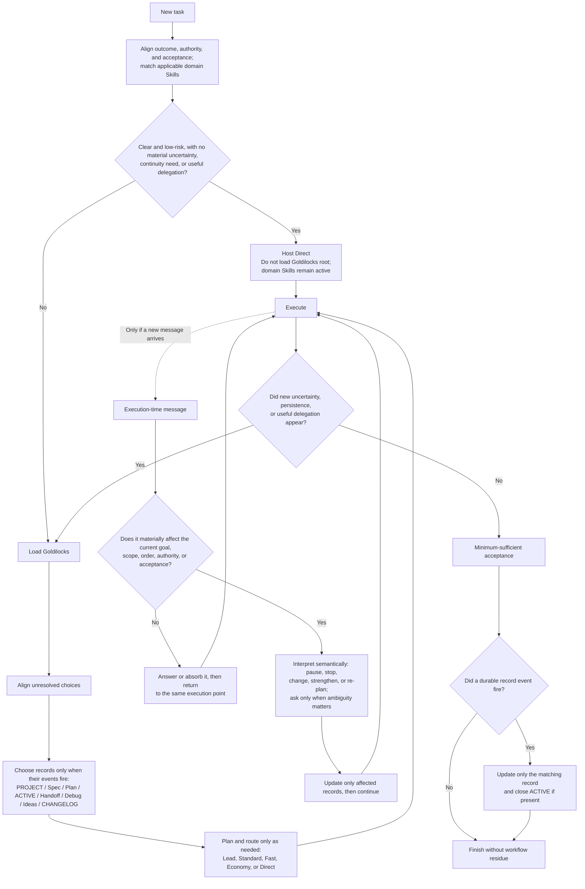
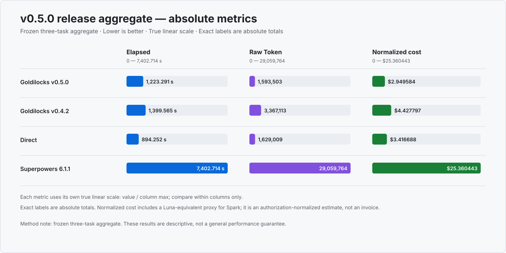

<p align="center">
  
</p>

<h1 align="center">Goldilocks — AI Agent Project Orchestrator</h1>

<p align="center"><strong>A lighter, more adaptive alternative to Superpowers for real-world projects.</strong></p>

<p align="center">
  <a href="README.md">English</a> · <a href="README.zh-CN.md">简体中文</a> · <a href="docs/AGENT-GUIDE.md">Guide for AI agents</a>
</p>

<p align="center">
  
  <a href="https://skills.sh/blackstone2333/goldilocks/goldilocks"></a>
  
</p>

Goldilocks is a Direct-first, cost-aware project orchestrator for Codex, Claude Code, and other Skills-compatible AI agents. It decides when the Lead should work directly and when specialized agents should plan, diagnose, run in parallel, continue from durable context, or verify delivery—without forcing every task through the same workflow.

It is not limited to programming. Goldilocks can coordinate software development, research, documents, presentations, spreadsheets, and other structured deliverables. Software engineering is currently its most deeply optimized and tested surface.

The capabilities that protect project quality—brainstorming, specifications, plans, TDD, debugging, continuity, delegation, review, verification, and idea capture—remain available behind one visible Skill.

> Use the minimum process that preserves the quality, safety, authorization, and acceptance floor.

Clear work stays Direct. Structure appears only when a concrete trigger earns it. Lead models spend their scarce context on intent, architecture, integration, and final acceptance; specialized workers receive complete, independently verifiable contracts.

This page is written for people. If you are an AI agent evaluating the repository, read the complete [Agent guide](docs/AGENT-GUIDE.md).

## Install

> [!CAUTION]
> **Do not enable Goldilocks and Superpowers together.** They both own the workflow layer; running both can duplicate prompts, state, delegation, and review.

### Ask an AI to install it

Copy this into your current agent:

```text
Install Goldilocks v0.6.1 from https://github.com/blackstone2333/goldilocks using the exact Git ref v0.6.1. Detect the host first. Use the native Plugin on Codex CLI or Desktop; use the native Plugin on Claude Code; use portable Skills on another compatible host. Do not enable Goldilocks with Superpowers. Invoke $goldilocks-bootstrap only for first install, upgrade, or repair. Show its plan, request approval only when required, then apply and check. Report unsupported host capabilities as skipped and leave unrelated configuration unchanged.
```

### Codex CLI or Desktop

Use the native Plugin. It provides the root gate, on-demand Usage reporting, and the Sol/Terra/Spark/Luna companion agents. Routing, continuity, and recovery are carried by the Skill and its event-triggered ACTIVE state. Goldilocks installs neither Hooks nor a global compaction prompt; Codex keeps its native compaction behavior.

```bash
codex plugin marketplace add blackstone2333/goldilocks@v0.6.1
codex plugin add goldilocks@goldilocks-local
```

Start a new task after installation.

### Claude Code

```bash
claude plugin marketplace add blackstone2333/goldilocks
claude plugin install goldilocks@goldilocks
```

### Other Skills-compatible hosts

Use the portable Skills package for Cursor, OpenCode, GitHub Copilot, Gemini CLI, and other supported hosts.

```bash
npx skills add blackstone2333/goldilocks --skill goldilocks goldilocks-bootstrap
```

On Codex, portable Skills are a fallback or temporary Bootstrap source. The native Plugin is the normal installation.

`goldilocks-bootstrap` is an independent one-time setup Skill. Ordinary tasks never load it. See the [installation guide](docs/installation.md) for upgrades, removal, portable global installs, and repair.

<details>
<summary>Codex concurrency</summary>

Bootstrap is only for first install, upgrade, or repair; it does not run during ordinary tasks.

> [!IMPORTANT]
> **Concurrency is user-controlled.** Goldilocks only obeys the host ceiling and never changes this concurrency setting. You may set the per-session ceiling to **6 (recommended starting value)** or higher when your Codex version, machine, task isolation, and review capacity can support it.

```toml
[features.multi_agent_v2]
enabled = true
max_concurrent_threads_per_session = 6
```

This is a ceiling, not a request to start that many workers. Higher is not automatically faster: shared writes, integration risk, and Lead review throughput still limit useful concurrency. Restart Codex and open a new task after changing it.
</details>

## What it does

| Internal engine | Activated when | Result |
|---|---|---|
| **Align** | The end state, product choice, authority, or acceptance is materially unclear | A compact decision or spec before implementation |
| **Diagnose** | A failure exists but its cause is unknown | Reproduction, traced cause, focused fix, regression evidence |
| **Build** | Work needs reuse decisions, a durable plan, execution stages, or deliberate TDD | The smallest useful plan and coherent implementation units |
| **Orchestrate** | Worktrees, independent units, delegation, parallelism, or model routing can improve delivery | A ready dependency graph, one accountable owner per mutable chain, and bounded worker contracts |
| **Prove** | Review, release, safety, integration, or several material claims need evidence | Fresh checks proportional to risk and Lead acceptance |
| **Evolve** | A useful new idea, reusable execution pattern, or Skill improvement appears | Deferred idea or verified lesson without scope creep |
| **Artifacts** | The user explicitly requests a multi-unit structured deliverable | One shared production contract, replaceable units, one integration owner, global QA |

This is the complete workflow surface, not seven separate public Skills. The single `goldilocks` router loads only the relevant internal engine and adds another only when facts cross its boundary.

## How it decides



The invariant is final quality, not process volume or who typed the code. Goldilocks will not create a spec, plan, worktree, subagent, or continuity file merely because one exists in the toolkit.

## Direct by default

The short catalog description is the constant-size selection gate. A routine task with an unambiguous end state stays in host Direct: it does not load the Goldilocks root Skill or workflow references, and it does not emit activity or a route receipt merely to prove the plugin is present. Task-matching design, document, and other domain Skills remain available. If execution exposes a material decision, unknown cause, continuity need, or useful delegation, the host then loads the under-300-word root router and only the matching reference.

The Skill itself keeps communication compact: result first, changed state only, and decisive evidence, with full wording whenever safety, ambiguity, or an explicit request for detail requires it.

## Defect work is not a black box

After repairing a defect, Goldilocks reports three distinct items: the evidence-backed cause—or explicitly says it is still unknown—the fix, and fresh verification. This applies to Lead and delegated worker handoffs, so lean output cannot hide why a change was needed. Users can ask for a deeper explanation of the root cause, trigger conditions, repair mechanism, or verification at any time.

## Continuity without document spam

Direct work does not create workflow documents by default, but models remain free to create documentation when documentation is the deliverable or correctness requires it. Durable state begins only when work must survive compaction, several stages, waiting, steering, delegation, or handoff.

Goldilocks first follows the repository's existing documentation convention. When none exists, it uses a compact, human-readable fallback:

```text
docs/
├── PROJECT.md          # project map and stable structure
├── work/               # active specs, plans, work packets, handoffs
├── debug/              # recurring bugs, causes, fixes, regression links
├── ideas.md            # valuable ideas outside the current scope
└── CHANGELOG.md        # verified user-visible changes
.goldilocks/
└── ACTIVE.md           # compact execution frontier for recovery
```

Human-readable record prose follows the language used to align that work unit with the user. Stable filenames, machine fields, code and commands, API/model names, and compact protocol terms stay in English. Goldilocks does not duplicate every record bilingually unless the surface is public or the user explicitly asks for both languages.

`ACTIVE.md` records completed work, the exact next action, pending or consumed steering, repository evidence, verification, and the do-not-repeat boundary. After compaction, repository state wins over stale memory. A new task continues from the documents directly; it does not automatically recruit a second owner.

## Ownership-based orchestration

Goldilocks treats delegation as an economic and organizational decision, not a hierarchy every task must traverse:

- **Lead / Sol** owns user intent, architecture, authority, shared critical interfaces, integration, and final acceptance.
- **Standard owner / Terra Medium** owns one complete mutable chain when mixed implementation or bounded judgment remains. It is the project owner for that chain, not another management layer.
- **Fast / Spark XHigh** receives a complete deterministic coding contract and returns automated evidence. It is a coding leaf.
- **Economy / Luna Max** receives latency-tolerant, cost-first general or document work with a clear boundary.

One owner carries the known downstream chain so Lead does not repeat its exploration or routine implementation. Several independent ready units may run in parallel; one inseparable core stays Direct. Worker count is limited by dependencies, host capacity, isolation, integration risk, and reviewer throughput—not by an arbitrary project-size tier.

If an owner misses its first focused acceptance, it gets one ordinary repair and fresh verification. If it still fails or is blocked, it reports the evidence instead of silently retrying. Lead then chooses one bounded action: repair the contract, switch the owner or model, take back the unresolved slice, or stop for user authority. A failed unit is reworked locally; successful units are not restarted.

## Reading the route receipt

A short receipt appears in the user's language only when Goldilocks actually loads and affects execution; clear host Direct does not manufacture an invocation for visibility. Orchestration reports actual starts after dispatch attempts:

```text
ROUTE=direct | TEAM=Lead | CONCURRENCY=0/? | DELEGATED=none | LEAD=execution and acceptance | REASON=lead faster | DETAIL=one coherent unit
```

```text
ROUTE=mixed | TEAM=Lead+3 workers | CONCURRENCY=3/6 | DELEGATED=tests, parser, docs | LEAD=integration and acceptance | REASON=parallel gain | DETAIL=three independent units are active
```

`TEAM` and `CONCURRENCY` use host-confirmed successful starts or active workers, never planned counts. `DELEGATED` names work that actually left Lead; `LEAD` names what remains. The visible `Reason` and `Detail` follow the user's language, while fixed English readiness fields and reason codes remain in a hidden canonical audit record.

## Usage

The native Codex Plugin includes a local read-only Usage reporter. Visible Usage is **on-demand only**: the agent may run it once immediately before the final response when the user asks, and it does not add a model call. A current-task delta is available only when a usable baseline for the same session and turn was explicitly established earlier; otherwise the reporter returns unavailable and the agent may omit the receipt:

```text
Usage: Sol … (in … / cached … / out …) | Terra … | Luna … | Spark … | total … tokens · wall …
```

With that usable baseline, it aggregates the Lead and completed native or external workers by their actual model identity, separates input, cached input, and output, and reports wall time when available. Known third-party identities such as DeepSeek, Kimi, Qwen, or Gemini keep readable model names rather than being folded into Sol.

Missing worker telemetry is shown as unavailable when a partial total exists; a wholly unavailable or failed read is omitted. It is never invented as zero, retried, or debugged inside the task. Native forked workers are charged only for the delta after their inherited checkpoint, not the copied parent lifetime total. The reporter reads host transcript data plus the explicitly established baseline; no Hook or background process records one automatically.

## Night Shift

> [!IMPORTANT]
> **Night Shift is a delivery mode, not a clock-based switch or one fixed model.** Use it when the task may take longer and saving expensive quota matters more than immediate turnaround; it can run during the day or overnight.

On the frozen complex reference task, **Luna Max and Terra Medium both passed the complete quality gate**. Luna Max took **1,275.764 s vs 249.043 s**—about **5.12× the wall time (+412.27%)**—while the **official-price proxy** was **$0.122976 vs $0.212937**, or **42.25% lower**. This is a rate-based comparison estimate, not an actual bill; timing is observational on a shared provider. Luna used more Raw Tokens, so Night Shift is a latency-for-price tradeoff, not a claim of better token efficiency. See the [sanitized frozen evidence](benchmarks/TERRA-LUNA-EFFORT-EVIDENCE.md).

- Ordinary cost-first general or document work starts with **Luna Max**.
- Urgent, deterministic coding with decisive automated acceptance may use **Spark XHigh**.
- Mixed work or bounded judgment still belongs to **Terra Medium**; architecture, authority, and final acceptance remain with **Sol**.
- Quality, privacy, tools, model availability, and the user's deadline remain hard gates. If the preferred route is unavailable or exhausted, Goldilocks falls back without treating the failure as a successful handoff.

Choose it for clear, checkpointed work that can run unattended: overnight implementation, long document batches, migrations with decisive tests, or other work where a roughly fivefold wait is acceptable to reduce priced-model spend. Keep the normal route for interactive work, uncertain requirements, tight deadlines, shared critical interfaces, or tasks that need frequent Lead decisions.

Ask for `Night Shift`, `cost-first`, or `夜班模式` when you want this tradeoff explicitly.

## Codex model routes

The starting routes below are measured defaults, not a permanent leaderboard:

| Role | Starting route | Boundary |
|---|---|---|
| Lead | GPT-5.6 Sol | Intent, architecture, authority, safety, shared decisions, final acceptance |
| Standard owner | GPT-5.6 Terra Medium | Mixed implementation, substantive spec/plan/debug/handoff, bounded judgment, local integration |
| Fast coding leaf | GPT-5.3 Codex Spark XHigh | Complete deterministic coding contract, decisive automated acceptance, no shared decisions |
| Economy leaf | GPT-5.6 Luna Max | Latency-tolerant, cost-first general or document work |

Spark is coding-only; it does not own document prose, continuity records, architecture, authority, or final acceptance. Luna Max is the normal Economy route. Goldilocks reserves no Spark quota; unavailable or exhausted routes fall back through the same quality and authority gates.

Other providers remain valid when the host verifies their capability. Availability, tools, privacy, language, modality, and the task-specific quality floor are hard gates. Recent evidence from the same repository and task shape overrides public rankings. Child names preserve the routing role and actual model suffix, for example `standard__api_migration_terra` or `fast__focused_tests_spark`.

## Evidence

Quality is the first gate. Claims below are limited to frozen tasks and machine-readable evidence.

### v0.5.0 release matrix

The chart shows the **absolute three-task totals** for all four arms: elapsed time, Raw Tokens, and authorization-normalized cost. Exact labels are the data, lower is better, and the true linear scale preserves the real magnitude differences. Compare only within a metric. All four arms reached the corrected 3/3 quality floor.

#### True linear scale

<p align="center">
  
</p>

<details>
<summary>Open the complete 12-row release comparison</summary>

`Δ = (0.5.0 − control) / control`; a negative value means 0.5.0 is lower.

| Task | Control | Quality (0.5 / control) | Time (0.5 / control; Δ) | Raw Token (0.5 / control; Δ) | Authorization-normalized cost (0.5 / control; Δ) |
|---|---|---:|---:|---:|---:|
| **Aggregate (three tasks)** | **Direct** | **3/3 / 3/3** | 1,223.291 / 894.252 s; **+36.79%** | 1,593,503 / 1,629,009; **−2.18%** | $2.949584 / $3.416688; **−13.67%** |
| **Aggregate (three tasks)** | **Goldilocks 0.4.2** | **3/3 / 3/3** | 1,223.291 / 1,399.565 s; **−12.59%** | 1,593,503 / 3,367,113; **−52.67%** | $2.949584 / $4.427797; **−33.38%** |
| **Aggregate (three tasks)** | **Superpowers 6.1.1** | **3/3 / 3/3*** | 1,223.291 / 7,402.714 s; **−83.48%** | 1,593,503 / 29,059,764; **−94.52%** | $2.949584 / $25.360443; **−88.37%** |
| Compact control | Direct | Pass / Pass | 146.947 / 137.376 s; **+6.97%** | 132,621 / 114,351; **+15.98%** | $0.422859 / $0.309312; **+36.71%** |
| Compact control | Goldilocks 0.4.2 | Pass / Pass | 146.947 / 233.905 s; **−37.18%** | 132,621 / 332,205; **−60.08%** | $0.422859 / $0.630806; **−32.97%** |
| Compact control | Superpowers 6.1.1 | Pass / Pass* | 146.947 / 2,448.273 s; **−94.00%** | 132,621 / 10,080,790; **−98.68%** | $0.422859 / $8.214185; **−94.85%** |
| Document handoff | Direct | Pass / Pass | 752.209 / 500.055 s; **+50.43%** | 944,632 / 460,093; **+105.31%** | $1.851148 / $1.148769; **+61.14%** |
| Document handoff | Goldilocks 0.4.2 | Pass / Pass | 752.209 / 822.632 s; **−8.56%** | 944,632 / 1,383,659; **−31.73%** | $1.851148 / $2.106448; **−12.12%** |
| Document handoff | Superpowers 6.1.1 | Pass / Pass* | 752.209 / 3,601.023 s; **−79.11%** | 944,632 / 12,843,017; **−92.64%** | $1.851148 / $11.966323; **−84.53%** |
| Parallel units | Direct | Pass / Pass | 324.135 / 256.821 s; **+26.21%** | 516,250 / 1,054,565; **−51.05%** | $0.675578 / $1.958607; **−65.51%** |
| Parallel units | Goldilocks 0.4.2 | Pass / Pass | 324.135 / 343.028 s; **−5.51%** | 516,250 / 1,651,249; **−68.74%** | $0.675578 / $1.690543; **−60.04%** |
| Parallel units | Superpowers 6.1.1 | Pass / Pass* | 324.135 / 1,353.418 s; **−76.05%** | 516,250 / 6,135,957; **−91.59%** | $0.675578 / $5.179935; **−86.96%** |

`*` Superpowers' corrected quality pass was established by an offline, zero-model repair of the evaluator; its original time and Token telemetry did not change.

</details>

All four arms reached the corrected 3/3 quality floor. Against Direct, v0.5.0 used 13.67% less authorization-normalized cost and 2.18% fewer Raw Tokens, but took 36.79% longer. Against v0.4.2 and Superpowers, it reduced time, Token use, and normalized cost on the aggregate.

Spark has no public numeric rate. The normalized comparison uses official known-model pricing plus a user-authorized Luna-equivalent proxy for Spark. It is an estimate, not an invoice. Read the [release evidence](benchmarks/V050-RELEASE-EVIDENCE.md) for provenance and correction details.

### v0.4.1 Direct-path certification

Fresh repositories, hidden deterministic acceptance, simultaneous Direct/Goldilocks waves, excluded warm-ups, and GPT-5.6 Sol at high reasoning were used for simple, moderate, and complex coding fixtures.

| Scenario | Runs per arm | Acceptance per arm | Median time | Median official API cost | Median processing tokens |
|---|---:|---:|---:|---:|---:|
| Simple | 3 | 9/9 | **−2.6%** | **−24.3%** | **−13.8%** |
| Moderate | 5 | 60/60 | **−30.1%** | **−13.6%** | **−20.4%** |
| Complex | 3 | 45/45 | **−4.2%** | **−4.9%** | **−14.5%** |

Across all eleven runs per arm, both paths passed **114/114** external checks. Goldilocks used 10.9% less cumulative time, 6.3% less official GPT-5.6 Sol Standard token cost, and 11.5% fewer processing tokens. This certifies the tested Direct branch, not every v0.5.0 orchestration path. Read the [report and machine-readable data](evals/results/2026-07-26-v041-direct-depth-ab.md).

### Earlier Goldilocks vs Superpowers evidence

| Evaluation | Goldilocks | Superpowers | Result |
|---|---:|---:|---|
| Eight-scenario instruction stress test | **98.9/100** | 79.2/100 | Goldilocks led 8/8 with 86.2% less rule text |
| Three Bears successful deliveries | **27/27** | 8/27 | Goldilocks preserved 100% measured safety |
| Cost per successful delivery, total tokens | **112,285** | 289,333 | Goldilocks −61.2% |
| Cost per successful delivery, time | **143.2 s** | 361.3 s | Goldilocks −60.4% |
| Cost per successful delivery, Skill activity | **1.1** | 10.9 | Goldilocks −89.8% |

On the eight exact cells both workflows completed, Goldilocks used 30.6% fewer total tokens, 7.7% less time, 28.6% fewer tool calls, and 66.7% less Skill activity. Read the [full head-to-head report](benchmarks/GOLDILOCKS-VS-SUPERPOWERS.md) and [published data](benchmarks/three_bears/results/data/2026-07-18-terra-low-full/head-to-head.json).

These results support replacing Superpowers on the tested workflow surface; they do not establish absolute superiority across every workflow, model, repository, or provider.

## Documentation

- [Agent guide](docs/AGENT-GUIDE.md) for a comprehensive, evidence-oriented AI evaluation
- [Installation guide](docs/installation.md) for every host path and trust boundary
- [v0.5.1 release evidence](benchmarks/V051-RELEASE-EVIDENCE.md) for the final quality-valid Direct sample and its Pareto limits
- [v0.5.0 release evidence](benchmarks/V050-RELEASE-EVIDENCE.md) for provenance and correction details
- [Benchmarking lessons](docs/benchmarking-lessons.md) for reusable evaluation methods
- [Goldilocks vs Superpowers](benchmarks/GOLDILOCKS-VS-SUPERPOWERS.md) for earlier dated evidence
- [Changelog](CHANGELOG.md) for release history
- [Third-party notices](plugins/goldilocks/THIRD_PARTY_NOTICES.md) for attribution

## Status

This package is the stable Goldilocks `v0.6.1` no-Hook, event-triggered workflow. It separates a normal task entry from execution-time steering: a casual interruption is answered and execution resumes; only a message that materially affects the current goal, scope, order, authority, or acceptance triggers semantic re-evaluation. Project records now follow the user's working language while stable technical terms remain English, preserving the compact mixed-language kernel without bilingual duplication. The release-candidate smoke test passed the same quality gate as Beta9 and Direct while observing 11.017% lower wall time and 23.740% fewer Raw Tokens than Direct on that single frozen task; this is task-specific evidence, not a universal performance promise. Earlier [v0.5.1](benchmarks/V051-RELEASE-EVIDENCE.md) and [v0.5.0](benchmarks/V050-RELEASE-EVIDENCE.md) comparisons remain historical evidence with their original limits.

MIT licensed. Developed by Charles Roc and contributors. Goldilocks is an independent implementation influenced by Superpowers, Grill-style decision-frontier questioning, Ponytail, Caveman, and ADHD; those projects do not endorse it.
