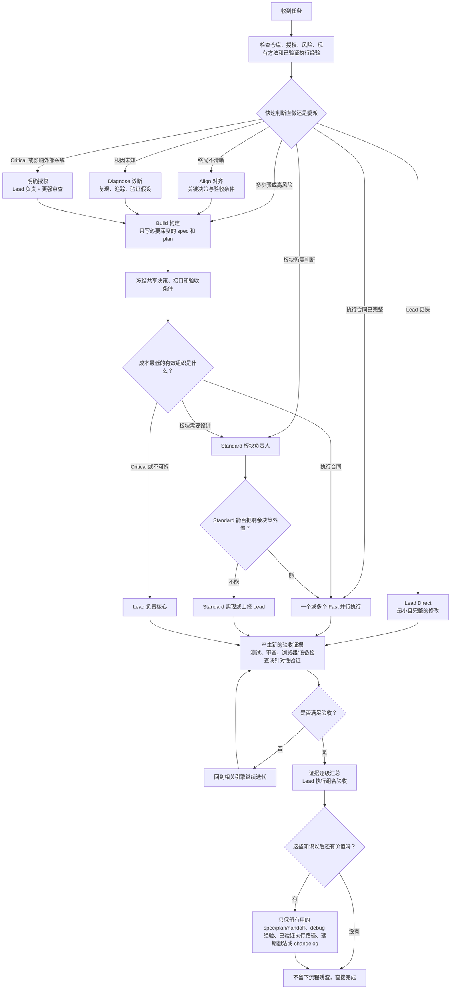

<p align="center">
  
</p>

<h1 align="center">Goldilocks</h1>

<p align="center"><strong>流程不多不少，质量刚刚好。</strong></p>

<p align="center">
  <a href="README.md">English</a> · <a href="README.zh-CN.md">简体中文</a>
</p>

<p align="center">
  
  
  <a href="https://skills.sh/blackstone2333/goldilocks/goldilocks"></a>
  
</p>

Goldilocks 是一套面向 Codex 的动态工作流插件，核心是我们提出的 **Just-Necessary Principle（刚好必要原则）**：

> 只使用维持固定质量、安全、授权与验证底线所必需的最少流程。

它提供与 Superpowers 兼容的工作流入口，但不会强迫每个任务加载整套流程。头脑风暴、计划、TDD、系统调试、worktree、委派、审查、验证、分支收尾和 Skill 编写能力都保留，只在任务确实需要时加载。

## 为什么做 Goldilocks

- **动态流程深度：** 明确任务先快速比较 Lead 直做与委派；复杂任务只增加真正有收益的管理层级。
- **渐进式加载：** 十三个兼容入口共享六个能力引擎，不复制十四套冗长流程。
- **原生与复用优先：** 先检查现有项目方法、标准库、成熟库和平台原生能力，再考虑自造方案。
- **只问关键问题：** 只有答案会实质改变终局、安全、范围或授权时才询问用户。
- **记录新想法但不扩张范围：** 有价值的旁支想法会留到后续迭代，不会偷偷塞进当前任务。
- **证据先于完成声明：** 信心、旧测试结果和子代理汇报都不能替代针对当前结果的新证据。
- **分层动态委派：** Lead 可以直接把执行合同交给 Fast，也可以把一个板块交给 Standard，再由 Standard 组织自己的 Fast 成员。
- **额度加权经济性：** 在控制总 token 的前提下，优先减少高系数、稀缺模型额度，并通过并行缩短关键路径。
- **执行经验复用：** 相似任务先检查已验证路径和失效条件，不重复支付同一轮组织判断成本。
- **Codex 强制路由：** 合格 Fast 工作自动交给 GPT-5.3-Codex-Spark；Fast 是叶子执行者；复杂 Lead 交接仍可继承完整上下文；并发审计不会凭错误关联误杀子任务。
- **安静的更新感知：** Codex 原生插件每天最多检查一次；已是最新版、离线或检查失败时完全静默，发现新版本只提醒一次且不改变当前任务。

## Goldilocks 到底能做什么

Goldilocks 是一个动态路由器，不是一套必须走完的瀑布流程。它会先观察仓库和任务，只启用真正能够降低风险的工作流引擎；流程深度可以变化，但最终验收标准保持不变。

| 遇到的情况 | Goldilocks 的行为 | 有长期价值时留下什么 |
|---|---|---|
| 很小、边界明确的修改 | 快速比较 Lead Direct 与一个 Fast 合同，选择更快完成并验证的路径 | 通常什么都不留 |
| 功能终局或产品决策不清晰 | 实现前对齐终局、关键取舍、约束和验收条件 | 需要跨会话保留时，记录精简 spec 或决策 |
| 不知道根因的 Bug | 先复现、追踪、验证假设并定位根因，再修复 | 问题可能复发时，保留可复用的 debug 经验 |
| 多步骤实现 | 只制定必要深度的计划，优先复用项目现有模式和成熟库，再按连贯单元执行 | 连续性需要时保存 plan、工作包、handoff 或项目结构图 |
| 多个互相独立的工作单元 | 构建就绪任务图，动态使用 Lead→Fast 或 Lead→Standard→Fast | 工作成员与板块证据逐级汇总，最终由 Lead 集成 |
| Critical 或会影响外部系统的动作 | 要求明确授权、Lead 负责、更强验证，并在适当时独立审查 | 授权与验证证据 |
| 当前范围之外但有价值的新想法 | 记录下来，不偷偷扩大当前任务范围 | 后续想法条目 |

### 执行与决策流程



Goldilocks 固定的是验收底线，而不是谁亲手写代码。Fast 表示拆解后的剩余自主判断很少，不表示原任务很小；Standard 表示一个边界明确但仍需局部判断的板块，不表示文件数量中等；Lead 负责用户意图、共享决策、冲突和最终质量，只在 Direct 更快或核心不可拆时亲自实现。

### v0.3 的分层动态编排

Goldilocks 把 Agent 团队看作一个小型公司。用户负责方向和结果；Lead 承担产品、技术与项目管理；Standard 负责一个具体板块，并把已经做完的局部决策转成 Fast 执行合同；Fast 负责实现和聚焦验证，但不能继续分发任务。

层级不是必走流程。小任务可以由 Lead 直做，也可以交给一个 Fast；中等任务可以直接交给 Fast、交给 Standard，或留在 Lead；大型项目可以由多个 Standard 各自管理 Fast，最后将板块证据逐级汇总。Goldilocks 不写死并行数量，实际并发由就绪任务图、平台容量、隔离工作区、集成风险和审核吞吐共同决定。

优化目标也不再是机械追求总 token 最少。质量与授权属于硬门槛，总 token 必须保持在合理范围；在有效方案中，优先降低额度加权后的昂贵 token 占比和真实关键路径。只要没有增加缺陷或审核债，略多的低系数、独立额度工作模型 token 可以换取更少的 Lead 额度和更短时间。

组合验收通过后，重复概率高的路径可以保存为精选执行经验。后续只有在模块、接口、风险、工具、计费通道和验收仍匹配时才复用。插件审计数据保存在本地并支持并发写入，但子智能体正常停止不等于成功验收，内部路由历史也不会污染面向用户的 changelog。

完整的角色边界、路由顺序、上下文策略、审计行为和发布验收见 [v0.3 分层动态编排设计](docs/v0.3-hierarchical-orchestration.zh-CN.md)。

## 证据：Goldilocks vs Superpowers

Goldilocks 对外只主张一个经过验证的窄结论：在已测试的工作流范围内，它是一个比 Superpowers 更可靠、更高效的**替代方案**。下面两轮验证回答不同问题，不把设计评分和真实运行成本混成一个总分。

### 测试一：指令层压力测试

最初的设计测试包含 8 个隔离场景。当时 Goldilocks 还叫 `just-necessary`，因此这轮证明的是 Goldilocks 的架构来源，不是正式版本的真实运行性能。Goldilocks 设计平均得分 **98.9/100，Superpowers 为 79.2/100**；8 个场景全部领先，规则文本少 **86.2%**。

<p align="center">
  
</p>

### 测试二：真实 Agent 工作流认证

`v0.2.2` 认证构建使用 GPT-5.6 Terra / low 测试了 Baby、Mama、Papa 三档共 9 个任务；每个任务运行 3 个全新隔离项目，每套工作流 27 次尝试。完整探索实验共有 135 个有效 turn；公开的替代结论只使用其中 **54 个 Goldilocks/Superpowers 正面对照 turn**。

<p align="center">
  
</p>

Goldilocks **27/27** 成功交付，测得安全率 100%；Superpowers 成功 **8/27**，安全率 88.9%。Superpowers 有 19 次在修改源码前停止，因此只看原始总成本会错误奖励“没有交付”。

在双方都成功的 8 个完全相同样本里，Goldilocks 少用 30.6% 总 token、7.7% 时间、28.6% 工具调用和 66.7% Skill 活动；非缓存输入高 9.7%，这是同成功样本中唯一没有领先的效率指标。把全部尝试（包括失败）计入并除以成功交付数后，Goldilocks 少用 61.2% 总 token、70.5% 非缓存输入、60.4% 时间、55.4% 工具调用和 89.8% Skill 活动。

详细数据见[两轮正面对照报告](benchmarks/GOLDILOCKS-VS-SUPERPOWERS.zh-CN.md)、[完整运行认证](benchmarks/three_bears/results/2026-07-18-terra-low-full-certification.md)、[测试方法](benchmarks/three_bears/README.md)、[正面对照数据](benchmarks/three_bears/results/data/2026-07-18-terra-low-full/head-to-head.json)和[完整逐格审计数据](benchmarks/three_bears/results/data/2026-07-18-terra-low-full/results.json)。

## 安装

使用跨平台 `skills` CLI 安装完整的 Superpowers 兼容套件：

```bash
npx skills add blackstone2333/goldilocks --skill '*' --global --agent codex --yes
```

其他平台把 `codex` 替换为 `claude-code`、`cursor`、`opencode`、`github-copilot` 或 `gemini-cli`。如果只需要可独立工作的 Just-Necessary 核心路由器，把参数改为 `--skill goldilocks`。

Codex 原生插件：

```bash
codex plugin marketplace add blackstone2333/goldilocks
codex plugin add goldilocks@goldilocks-local
```

Claude Code 原生插件：

```bash
claude plugin marketplace add blackstone2333/goldilocks
claude plugin install goldilocks@goldilocks
```

不要同时启用 Goldilocks 和 Superpowers。项目级安装、更新命令、平台 ID 和兼容说明见[完整中文安装文档](docs/installation.zh-CN.md)。

## 包含哪些能力

Goldilocks 暴露了替换 Superpowers 所需的熟悉入口：

| 需求 | 入口 |
|---|---|
| 对齐不明确的终局 | `brainstorming` |
| 编写或执行实现计划 | `writing-plans`、`executing-plans` |
| 通过聚焦测试实现功能 | `test-driven-development` |
| 先定位根因再修复 | `systematic-debugging` |
| 隔离或拆分工作 | `using-git-worktrees`、`dispatching-parallel-agents`、`subagent-driven-development` |
| 请求或处理代码审查 | `requesting-code-review`、`receiving-code-review` |
| 验证完成并收尾分支 | `verification-before-completion`、`finishing-a-development-branch` |
| 创建或改进 Skill | `writing-skills` |

显式的 `goldilocks` 路由器替代 `using-superpowers`。它不会被自动注入每个任务，因此简单任务可以走零工作流 Skill 读取的 Direct 路径。

这些兼容入口按需加载六个共享引擎：

1. **Align：** 终局、关键决策、验收条件。
2. **Diagnose：** 复现、追踪、假设、根因。
3. **Build：** 计划、聚焦 TDD、连续执行。
4. **Orchestrate：** worktree、委派、模型路由、集成责任。
5. **Prove：** 审查、验证、授权、分支完成。
6. **Evolve：** 新想法记录、复盘和 Skill 迭代。

对于需要跨会话推进或交给其他工程师接手的工作，六个引擎共享一套轻量的 **Continuity Protocol（连续性协议）**。它优先复用仓库现有文档结构；没有约定时，才按需保存项目结构图、单一工作包或拆分的 spec/plan/handoff、精选 debug 经验、已验证执行路径、延期想法和面向用户的 changelog。Direct 任务默认不创建工作流记录，但当文档本身是交付物或正确性所需时，模型仍可自主创建或更新文档。内部执行经验与发布 changelog 始终分开，也不会增加新的可见 Skill 或执行引擎。

当压缩或中途引导威胁到正在执行的长任务时，连续性协议可以创建一个临时的 `.goldilocks/ACTIVE.md` 执行边界，保存稳定目标、已消费的引导、Done/In progress/Remaining、唯一的精确下一步、仓库与验证状态、禁止重做边界和终止条件。恢复时先读账本，再用 Git 事实校准；仓库证据优先。Codex 原生插件还附带默认静默的恢复 Hook 和可选的完整压缩提示词。详见[安装与 Codex 恢复配置](docs/installation.zh-CN.md#codex-连续性恢复)。

针对多单元计划，共享的 **Hierarchical Orchestration Protocol（分层编排协议）** 会先比较 Direct 与委派，再把完整执行合同交给 Fast、把具体板块交给 Standard，或者由 Standard 在完成局部设计后继续组织 Fast。模型选择综合质量门、额度加权消耗、总 token 包络、关键路径、置信度、时效性、执行经验和 Pareto 候选集。公开模型数据只是种子，[本地证据优先](docs/model-routing-survey-2026-07-18.md)。

Codex 原生插件会把这套协议变成执行守卫。每次派发都必须声明 `fast__`、`standard__` 或 `lead__`。`fast__` 自动改写为 Spark，且 Fast 不能继续创建子智能体；Standard 必须显式选择模型，并可在合同范围内组织 Fast。任务本地路由使用零到四轮相关上下文；真正需要完整对话的 `lead__` 交接可以继承父 Lead 模型和完整历史。路由观察写入支持并发的 SQLite 本地状态；宿主无法唯一关联并发或嵌套启动时，只记录“不可验证”，不会误停正确子任务。跨平台 Skill 安装保留协议，但无法强制拦截 Codex 原生调用。

## 公开模型路由种子

下面的种子数据截至 **2026-07-18**。它是模型路由的初始参考，不是永久排行榜，也不意味着模型必须机械地调用某个名字。可用性、工具权限、上下文、模态、语言、数据政策和任务风险属于硬门槛；同仓库、同任务形态的近期本地证据优先于公开种子。未列出的模型只要通过同样的门槛，仍然可以参与选择。

### 选择标准

1. 先检查上述硬门槛。
2. 低于任务质量线的候选直接淘汰，即使免费也不选。
3. 使用加权几何平均估算质量，避免关键短板被平均数掩盖：`Q = 100 × product(score_i ^ weight_i)`。
4. 订阅场景估算 `QuotaBurn = Σ(用量 × 账户系数 × 通道稀缺度) + 重试 + 审核 + 集成`，同时约束总 token 不明显膨胀。
5. 保留质量、额度消耗和延迟的 Pareto 候选；账户真实额度证据不可用时，再退回每次成功交付成本和公开性价比分数。

订阅额度按机会成本计算，不视为零成本；独立额度通道可以降低成本，但不能降低质量或安全门槛。数据过时、模型版本或 Agent harness 不匹配、样本量太小、缺少领域证据、没有本地复现，都会降低结论置信度。

### 任务画像与初始质量线

| 任务画像 | 默认角色 | 质量线 | 重点证据 |
|---|---|---:|---|
| 机械编辑 | Fast | 65 | 本地验收、Aider 编辑正确率、格式可靠性、速度 |
| 测试编写 | Fast 或 Standard | 70 | 本地回归/变异检测、SWE-bench、Terminal-Bench、编辑正确率 |
| 仓库级实现 | Standard | 75 | SWE-bench、Terminal-Bench、本地仓库成功率、编辑正确率 |
| 探索与调查 | Fast | 60 | 本地摘要价值、工具可靠性、速度、上下文适配 |
| 审查与安全 | Lead | 85 | 本地缺陷发现、仓库 Agent 证据、推理与安全领域证据 |
| 前端与多模态 | Standard 或 Lead | 75 | 本地视觉验收、领域证据、模态与工具可靠性 |

这些只是初始质量线，不是所有环境通用的考试分数。Critical 工作不能只凭性价比分配。测试可以交给工作模型编写和局部执行，但 Lead 必须审核断言，并在集成工作区重跑组合验证。

### 初始角色划分

| 角色 | 当前种子 | 较低置信度候选 | 工作边界 |
|---|---|---|---|
| Fast | GPT-5.3-Codex-Spark；GPT-5.6 Luna；Muse Spark 1.1；GLM-5.1 | MiniMax-M3；DeepSeek V4 Pro | 剩余自主判断低、验收确定的完整执行合同；Fast 是叶子执行者 |
| Standard | GPT-5.6 Terra；Grok 4.5；GPT-5.6 Luna；Muse Spark 1.1；Claude Sonnet 5；Gemini 3 Pro；GLM-5.1 | Qwen3.7 Max | 板块管理、局部设计、工作成员协调和可独立验收的实现 |
| Lead | Claude Opus 4.8；Claude Fable 5；GPT-5.5 | Kimi K3 | 用户意图、架构、Critical 判断、共享接口、冲突处理、组合验证与最终集成 |

在 Codex Pro 中，GPT-5.3-Codex-Spark 因独立使用额度降低了机会成本，是符合条件的 Fast 纯文本任务的第一候选。Fast 资格在 Lead 或 Standard 把关键决策外置之后判断，因此大型项目的大量实现也能变成 Fast 工作。Spark **不负责**架构、模糊的仓库级修改、安全或 Critical 决策、视觉/浏览器工作、最终审查和集成。Terra 是通用 Standard 初始选择；Luna 是低风险、高吞吐 Standard/Fast 初始选择；当前可用性与本地实测优先。

### 可比公开数据切片

这份小型切片只包含采集时同时拥有可比 Terminal-Bench 2.1 条目和 Artificial Analysis 数据的模型。“示例性价比”只在这个可比集合里归一化，**不是通用模型排行榜**。

| 模型 | Terminal-Bench 2.1 | TB 报告成本 | AA 混合 $/1M | AA 端到端延迟 | 示例性价比 |
|---|---:|---:|---:|---:|---:|
| Grok 4.5 | 79.3% | $134.09 | $1.35 | 17.74s | 100.0 |
| Muse Spark 1.1 | 76.2% | $198.05 | $0.78 | 24.10s | 94.0 |
| Claude Opus 4.8 | 78.9% | $286.94 | $3.85 | 45.91s | 91.3 |
| GPT-5.6 Luna | 75.7% | $241.45 | $0.87 | 83.47s | 79.9 |
| Claude Fable 5 | 83.8% | $552.67 | $7.70 | 132.16s | 79.8 |
| GPT-5.6 Terra | 78.4% | $421.15 | $2.17 | 141.16s | 73.9 |
| Claude Sonnet 5 | 74.6% | $288.18 | $1.54 | 199.71s | 70.6 |
| GPT-5.5 | 83.1% | $2,059.19 | $4.35 | 72.62s | 61.8 |
| GLM-5.1 | 58.7% | $277.14 | $0.90 | 70.79s | 52.2 |

Grok 4.5 的 Terminal-Bench 提交报告了 `-9.0%` hack 调整，因此注册表对其可靠性施加惩罚。Gemini 3 Pro 有可比的 Terminal-Bench 结果，但缺少匹配的当前价格行。Kimi K3、Qwen3.7 Max、MiniMax-M3 和 DeepSeek V4 Pro 有值得关注的综合数据，但缺少完全可比的当前 Terminal-Bench 条目，因此只作为本地 bake-off 候选，不作为已评分赢家。

证据来源包括 SWE-bench、Terminal-Bench、Aider Polyglot、LiveCodeBench、Artificial Analysis、官方能力文档和各提供商价格。可以直接检查[机器可读模型注册表](plugins/goldilocks/skills/goldilocks/assets/model-registry.json)以及[包含来源链接和局限性的完整筛查报告](docs/model-routing-survey-2026-07-18.md)。

### 一起改进这份种子

如果公开或本地证据与当前划分冲突，欢迎[提交 Issue](https://github.com/blackstone2333/goldilocks/issues)。有价值的报告最好包含：准确模型/版本/提供商、任务画像、Agent harness 与工具、推理等级、样本量、通过率、token 或金额成本、真实耗时、重试次数、审核投入和集成缺陷。同仓库可复现的实际结果，比再提供一个综合智力总分更有价值。

设计细节见 [v0.3 分层动态编排](docs/v0.3-hierarchical-orchestration.zh-CN.md)，底层能力引擎沿革见 [v0.2 能力与触发引擎](docs/v0.2-capability-trigger-engine.md)。

## 本地验证

不调用模型的验证：

```bash
python3 tests/test_v03_contract.py
python3 tests/test_three_bears_contract.py
python3 tests/test_agent_routing_hook.py
python3 tests/test_recovery_hook.py
python3 tests/test_update_checker.py
python3 benchmarks/three_bears/run.py --selftest
```

低成本在线冒烟测试：

```bash
python3 benchmarks/three_bears/run.py \
  --task baby-docs \
  --arms goldilocks,superpowers \
  --model gpt-5.6-terra \
  --reasoning low \
  --runs 1 \
  --workers 2
```

完整矩阵的复现方式见 [Three Bears](benchmarks/three_bears/README.md)。

## 当前阶段与方向

Goldilocks 现已更新至 `v0.3.1`。现有证据表明，它能够在已测试范围内更高效地替代 Superpowers，但分层动态编排仍属于架构方向，不冒充新的性能认证。Codex 原生插件现在能够低频感知更新，但不会自动安装，也不会给纯 Skill 增加启动开销。公开运行认证仍是 v0.2.2；真实项目需要继续测量质量不劣于原方案、Lead 额度占比、总 token 变化、关键路径、重试和集成缺陷。详见[更新记录](CHANGELOG.zh-CN.md)，欢迎提出[意见和建议](https://github.com/blackstone2333/goldilocks/issues)。

接下来的迭代重点：

- 在不削弱质量门的前提下，降低 Mama/Papa 任务中的测试与验证开销；
- 扩展到更大的真实仓库和更多编程语言；
- 增加重复次数，再考虑更广泛的性能声明；
- 在长期项目中验证 Standard→Fast 嵌套委派、连续性和执行经验复用；
- 测量总 token 变化、额度加权后的 Lead 占比、关键路径、重试和集成缺陷；
- 保持 Superpowers 入口兼容，同时确保 Direct 路径始终足够直接。

## 许可证与理念来源

Goldilocks 使用 MIT 许可证，由 Charles Roc 与贡献者共同开发。它是独立实现，理念受到 Superpowers、Grill 的关键决策提问方式以及 Ponytail 的复用/原生优先思想影响；这些项目并不为 Goldilocks 背书。详见[第三方说明](plugins/goldilocks/THIRD_PARTY_NOTICES.md)。
