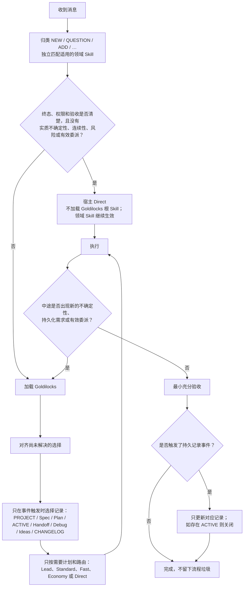
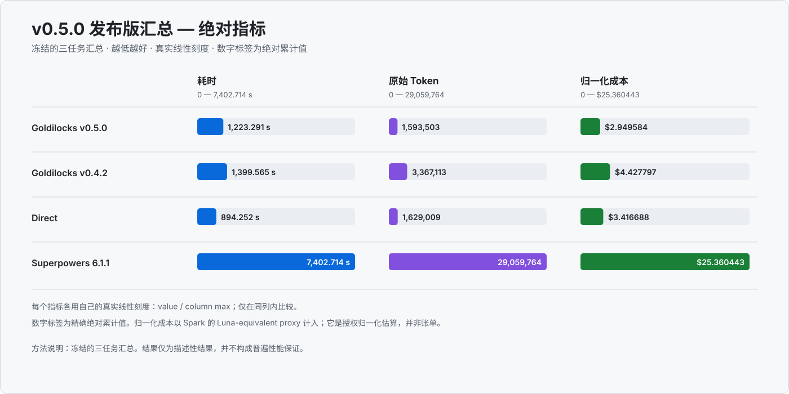

<p align="center">
  
</p>

<h1 align="center">Goldilocks｜AI Agent 项目智能编排器</h1>

<p align="center"><strong>一个比 Superpowers 更轻、更灵活的项目工作流与质量控制方案。</strong></p>

<p align="center">
  <a href="README.md">English</a> · <a href="README.zh-CN.md">简体中文</a> · <a href="docs/AGENT-GUIDE.md">给 AI Agent 的项目指南</a>
</p>

<p align="center">
  
  <a href="https://skills.sh/blackstone2333/goldilocks/goldilocks"></a>
  
</p>

Goldilocks 是面向 Codex、Claude Code 和其他兼容 Skills 宿主的 Direct-first、成本感知型 AI Agent 项目智能编排器。它会动态判断什么时候由主模型直接完成，什么时候调用专业 Agent 规划、诊断、并行执行、延续项目上下文或完成质量验收，而不是让每个任务都套用同一套固定流程。

它不只服务于编程。软件开发、研究、文档、演示、表格及其他结构化交付项目都可以进入这套编排；其中工程开发是当前优化和实证验证最充分的场景。

头脑风暴、spec、plan、TDD、debug、连续性、委派、审查、验收和新想法留存等质量保障能力都还在，但只对外显示一个 Skill。

> 只使用足以维持质量、安全、授权和验收底线的流程。

清晰任务保持 Direct；只有出现具体触发条件才增加结构。Lead 模型把稀缺上下文用在理解意图、架构、整合和最终验收上，把完整、可独立验证的执行合同交给最合适的专业模型。

本页面写给人类读者。需要让 AI Agent 全面评估仓库时，请直接交给它[项目指南](docs/AGENT-GUIDE.md)。

## 安装

> [!CAUTION]
> **不要同时启用 Goldilocks 和 Superpowers。** 两者都会接管工作流层；同时启用可能造成提示、状态、委派和审查重复。

### 让 AI 帮你安装

把下面这段直接发给你正在使用的 Agent：

```text
请从 https://github.com/blackstone2333/goldilocks 安装 Goldilocks v0.6.0 正式版，并锁定 Git ref v0.6.0。先识别当前宿主：Codex CLI 或 Desktop 使用原生 Plugin，Claude Code 使用原生 Plugin，其他兼容宿主使用 portable Skills。不要与 Superpowers 同时启用。仅在首次安装、升级或修复时调用 $goldilocks-bootstrap；先展示计划，只在确实需要授权时向我确认，然后执行 apply 和 check。不支持的宿主能力标为 skipped，不修改无关配置。
```

### Codex CLI 或 Desktop

优先安装原生 Plugin。它会带上根门禁、按需 Usage 统计，以及 Sol、Terra、Spark、Luna 四个伴随 Agent。路由、连续性和恢复由 Skill 及其事件触发 ACTIVE 状态承载。Goldilocks 不安装 Hook，也不设置全局压缩提示；Codex 继续使用原生压缩行为。

```bash
codex plugin marketplace add blackstone2333/goldilocks@v0.6.0
codex plugin add goldilocks@goldilocks-local
```

安装完成后新建任务。

### Claude Code

```bash
claude plugin marketplace add blackstone2333/goldilocks
claude plugin install goldilocks@goldilocks
```

### 其他兼容 Skills 的宿主

Cursor、OpenCode、GitHub Copilot、Gemini CLI 等宿主使用 portable Skills。

```bash
npx skills add blackstone2333/goldilocks --skill goldilocks goldilocks-bootstrap
```

Codex 中的 portable Skills 仅作为 fallback 或临时 Bootstrap 来源，日常使用仍应安装原生 Plugin。

`goldilocks-bootstrap` 是独立的一次性安装 Skill，普通任务不会加载。升级、卸载、全局 portable 安装和修复流程见[完整安装说明](docs/installation.zh-CN.md)。

<details>
<summary>Codex 可选并发配置</summary>

Bootstrap 仅用于首次安装、升级或修复，不会在普通任务中运行。

> [!IMPORTANT]
> **并发数量由用户控制。** Goldilocks 只遵守宿主上限，绝不会修改这里的并发配置。你可以把单任务子线程上限设置为 **6（建议起始值）**；当 Codex 版本、机器性能、任务隔离和审核能力都足够时，也可以继续提高。

```toml
[features.multi_agent_v2]
enabled = true
max_concurrent_threads_per_session = 6
```

这只是上限，不代表每次都会创建这么多子智能体。更高也不一定更快：共享写入、整合风险和 Lead 的审核吞吐仍会限制有效并发。修改后重启 Codex 并新建任务。
</details>

## 它能做什么

| 内部引擎 | 何时启用 | 结果 |
|---|---|---|
| **Align** | 终局、产品选择、权限或验收存在实质不确定性 | 开工前形成紧凑决策或 spec |
| **Diagnose** | 已知有故障，但原因未知 | 复现、定位根因、聚焦修复、回归证据 |
| **Build** | 需要复用判断、持久计划、分阶段执行或有意识的 TDD | 最小必要计划和连贯执行单元 |
| **Orchestrate** | worktree、独立单元、委派、并行或模型路由能改善交付 | 就绪依赖图、每条可变链唯一负责人和边界清晰的工作合同 |
| **Prove** | 审查、发布、安全、集成或多个重要声明需要证据 | 与风险相称的新鲜检查和 Lead 验收 |
| **Evolve** | 出现有价值的新想法、可复用路径或 Skill 改进 | 留存后续方向或已验证经验，不扩大当前范围 |
| **Artifacts** | 用户明确要求制作多单元结构化产物 | 一个共享生产合同、可替换单元、单一集成负责人和全局 QA |

这是一套完整能力面，不是七个公开 Skill。唯一的 `goldilocks` 路由器只加载当前需要的内部引擎；事实跨越边界时才增加第二个。

## 它如何判断



不变的是最终质量，而不是流程数量，也不是谁亲手写代码。Goldilocks 不会因为工具箱里有 spec、plan、worktree、子智能体或连续性文档，就强行创建它们。

## 默认 Direct

Skill 目录中的短描述承担常量级选择门。终态明确的例行任务会直接留在宿主 Direct：不加载 Goldilocks 根 Skill，不读取工作流参考，也不为展示自身而输出活动或路由回执；任务匹配的设计、文档等领域 Skill 仍可正常加载。执行中若出现实质决策、未知根因、连续性需求或值得委派的工作，才加载不到 300 词的根路由器，并按需进入对应参考。

Skill 自身保持精简沟通：结果先行、只报告状态变化、保留决定性证据；涉及安全、歧义或用户明确要求详细说明时使用完整说明。

## 修复过程不再是黑盒

修复故障后，Goldilocks 会分别说明三项内容：有证据支持的原因——仍无法确定时明确说明未知——采取的修复，以及新鲜验证结果。该要求同时约束 Lead 和被委派的工作模型，精简输出不能再隐藏“为什么要这样改”。用户随时可以继续要求详细解释根因、触发条件、修复原理或验证方法。

## 连续性，但不滥造文档

Direct 默认不创建流程文档，但当文档本身是交付物或正确性确实需要时，模型仍可自主建文档。只有任务需要跨越上下文压缩、多阶段、等待、用户中途引导、委派或交接时，才启用持久状态。

Goldilocks 优先沿用项目本身的文档约定。没有现成约定时，使用清爽、方便人类和其他 Agent 接手的项目记忆：

```text
docs/
├── PROJECT.md          # 项目地图和稳定结构
├── work/               # 当前 spec、plan、工作包和 handoff
├── debug/              # 可复发 bug、根因、解法和回归链接
├── ideas.md            # 当前范围之外的好想法
└── CHANGELOG.md        # 已验证的用户可见变化
.goldilocks/
└── ACTIVE.md           # 上下文恢复用的紧凑执行前沿
```

`ACTIVE.md` 记录已完成工作、精确下一步、待处理或已消费的用户引导、仓库证据、验收情况和“不要重复”边界。上下文压缩后，以仓库状态为准，不以过期记忆为准。新任务直接从已有文档继续，不会自动再招聘第二个 Owner。

## 基于负责人的动态编排

Goldilocks 把委派视为经济决策和组织决策，但不会让每项任务都逐层经过一套公司架构：

- **Lead / Sol** 负责用户意图、架构、权限、共享关键接口、整合和最终验收。
- **Standard 主负责人 / Terra Medium** 在混合实现或有界判断仍然存在时，承接一条完整可变链。它是这条链的项目负责人，不是新增管理层。
- **Fast / Spark XHigh** 接收可决定性验收的完整纯编程合同，并返回自动化证据；它是编程叶子。
- **Economy / Luna Max** 接收边界明确、不赶时间、成本优先的通用或文档工作。

一名负责人完成一条已知的完整后续链路，Lead 不重复它的探索和常规实现。多个独立就绪单元可以并行；不可分割的核心保持 Direct。并发数量取决于依赖、宿主容量、隔离条件、集成风险和审核吞吐，而不是僵硬的项目规模分级。

负责人第一次未通过聚焦验收时，可以进行一次常规修复并重新验证；仍未通过或已经阻塞时，必须上报原因和证据，不能静默重试。Lead 随后只做一个有边界的决定：修正合同、更换负责人或模型、收回未解决部分，或者因为需要用户授权而停止。失败单元局部返工，已经通过的单元不重新开始。

## 看懂路由回执

只有 Goldilocks 实际加载并影响执行时，才按用户语言显示一条短回执；清晰 Direct 不制造一次假调用来证明插件存在。进入编排后，在派发尝试完成后显示真实启动结果：

```text
路由=直接｜团队=主模型｜并发=0/?｜委派=无｜主模型=执行与验收｜理由=主模型更快｜详情=单一工作单元
```

```text
路由=混合｜团队=主模型+3 个子智能体｜并发=3/6｜委派=测试、解析、文档核对｜主模型=整合与验收｜理由=并行收益｜详情=三个独立单元已经启动
```

团队和并发只使用宿主确认的成功启动或活跃数量，不拿计划数冒充；委派说明真正交出去的工作，主模型说明仍由 Lead 保留的工作。面向用户的“理由”和“详情”跟随用户语言，完整 readiness 字段和固定英文原因码则保留在隐藏的 canonical 审计记录中。

## Usage 用量统计

Codex 原生 Plugin 提供本地只读 Usage 统计器。可见 Usage **仅按需**：只有用户明确索要时，Agent 才会在最终回复前调用一次，不会额外调用模型。只有同一 session 和 turn 先前已经显式建立可用基线，才能计算当前任务增量；否则统计器会返回暂不可用，Agent 可以省略回执：

```text
用量：Sol …（输入 … / 缓存 … / 输出 …） | Terra … | Luna … | Spark … | 总计 … tokens · 用时 …
```

存在上述可用基线时，它会按真实模型身份汇总 Lead、原生子智能体和外部 Worker，分别统计输入、缓存输入、输出，并在数据可用时显示总耗时。DeepSeek、Kimi、Qwen、Gemini 等第三方模型只要宿主提供真实身份，也会保留可读名称，不会全部算到 Sol 下面。

部分 Worker 的遥测缺失时，会在已有合计旁显示“暂不可用”；整轮没有可用数据或读取失败时则保持静默。它绝不会伪装成 0，也不会在任务里重试或排查数据库。原生 fork 子智能体只计算继承检查点之后的增量，不再把复制来的父对话生命周期总量算到本次任务。统计器读取宿主会话数据和此前显式建立的基线；没有 Hook 或后台流程自动记录基线。

## Night Shift 夜班模式

> [!IMPORTANT]
> **Night Shift 是一种交付模式，不是按时间自动切换，也不固定等于某个模型。** 当任务可以多跑一会、节省高价额度比立刻完成更重要时使用；白天可以开，真正过夜也可以。

在同一项冻结复杂任务里，**Luna Max 和 Terra Medium 都通过了完整质量验收**。Luna Max 用时 **1,275.764 秒，对 Terra Medium 的 249.043 秒**，约为 **5.12 倍（慢 412.27%）**；按官方费率计算的**价格代理估算**是 **$0.122976 对 $0.212937**，约低 **42.25%**。这不是实际账单；共享服务商下的时间也只作为观察值。Luna 使用的 Raw Token 更多，所以 Night Shift 是“用等待换低价”，不是 Token 效率更高。完整证据见[脱敏冻结证据](benchmarks/TERRA-LUNA-EFFORT-EVIDENCE.zh-CN.md)。

- 普通的成本优先通用或文档工作，先考虑 **Luna Max**。
- 有明确自动验收、又比较赶时间的确定性编程，可以使用 **Spark XHigh**。
- 混合工作或有界判断仍交给 **Terra Medium**；架构、权限和最终验收仍由 **Sol** 负责。
- 质量、隐私、工具、模型可用性和用户截止时间始终是硬门槛。首选路线不可用或额度耗尽时，Goldilocks 会回退，不会把失败启动冒充成成功委派。

适合选择它的，是边界清楚、有检查点、可以无人值守的任务：过夜开发、长文档批处理、带决定性测试的迁移，或者其他能够接受约五倍等待、希望降低高价模型支出的工作。交互频繁、需求仍不确定、截止时间紧、涉及共享关键接口，或中途需要 Lead 频繁决策时，继续使用正常路线。

希望明确使用这条路线时，可以直接说 `Night Shift`、`成本优先` 或 `夜班模式`。

## Codex 模型路由

下面是实测后的起始建议，不是永久排行榜：

| 角色 | 起始路线 | 边界 |
|---|---|---|
| Lead | GPT-5.6 Sol | 意图、架构、权限、安全、共享决策和最终验收 |
| Standard 主负责人 | GPT-5.6 Terra Medium | 混合实现、实质 spec/plan/debug/handoff、有界判断和本域整合 |
| Fast 编程叶子 | GPT-5.3 Codex Spark XHigh | 完整确定性编程合同、决定性自动验收、无共享决策 |
| Economy 叶子 | GPT-5.6 Luna Max | 不赶时间、成本优先的通用或文档工作 |

Spark 只负责纯编程，不负责文档正文、连续性记录、架构、权限或最终验收。Luna Max 是默认 Economy 路线。Goldilocks 不为 Spark 预留额度；路线不可用或额度耗尽时，按同一套质量与权限门槛回退。

其他供应商模型也可以参与，但必须先由宿主确认能力。可用性、工具、隐私、语言、模态和任务质量底线都是硬门槛；同项目、同任务形态的近期结果优先于公开排名。子智能体名称保留路由角色和真实模型后缀，例如 `standard__api_migration_terra`、`fast__focused_tests_spark`。

## 证据

质量是第一道门槛。下面的结论只覆盖冻结任务和可复核的机器证据。

### v0.5.0 发布矩阵

这张柱状图展示四组方案在三项任务中的**绝对累计值**：耗时、Raw Token 和授权归一化成本。数字标签就是真实数据，越短越好；真实线性比例完整保留实际量级差异。只在同一项指标内比较。四组方案都达到修正后的 3/3 质量门槛。

#### 真实线性刻度

<p align="center">
  
</p>

<details>
<summary>展开完整 12 行发布对比</summary>

`Δ = (0.5.0 − 对照) / 对照`，负值代表 0.5.0 更低。

| 任务 | 对照 | 质量（0.5 / 对照） | 耗时（0.5 / 对照；Δ） | Raw Token（0.5 / 对照；Δ） | 授权归一化成本（0.5 / 对照；Δ） |
|---|---|---:|---:|---:|---:|
| **综合（三项累计）** | **Direct** | **3/3 / 3/3** | 1,223.291 / 894.252 s；**+36.79%** | 1,593,503 / 1,629,009；**−2.18%** | $2.949584 / $3.416688；**−13.67%** |
| **综合（三项累计）** | **Goldilocks 0.4.2** | **3/3 / 3/3** | 1,223.291 / 1,399.565 s；**−12.59%** | 1,593,503 / 3,367,113；**−52.67%** | $2.949584 / $4.427797；**−33.38%** |
| **综合（三项累计）** | **Superpowers 6.1.1** | **3/3 / 3/3*** | 1,223.291 / 7,402.714 s；**−83.48%** | 1,593,503 / 29,059,764；**−94.52%** | $2.949584 / $25.360443；**−88.37%** |
| 紧凑控制 | Direct | 通过 / 通过 | 146.947 / 137.376 s；**+6.97%** | 132,621 / 114,351；**+15.98%** | $0.422859 / $0.309312；**+36.71%** |
| 紧凑控制 | Goldilocks 0.4.2 | 通过 / 通过 | 146.947 / 233.905 s；**−37.18%** | 132,621 / 332,205；**−60.08%** | $0.422859 / $0.630806；**−32.97%** |
| 紧凑控制 | Superpowers 6.1.1 | 通过 / 通过* | 146.947 / 2,448.273 s；**−94.00%** | 132,621 / 10,080,790；**−98.68%** | $0.422859 / $8.214185；**−94.85%** |
| 文档交接 | Direct | 通过 / 通过 | 752.209 / 500.055 s；**+50.43%** | 944,632 / 460,093；**+105.31%** | $1.851148 / $1.148769；**+61.14%** |
| 文档交接 | Goldilocks 0.4.2 | 通过 / 通过 | 752.209 / 822.632 s；**−8.56%** | 944,632 / 1,383,659；**−31.73%** | $1.851148 / $2.106448；**−12.12%** |
| 文档交接 | Superpowers 6.1.1 | 通过 / 通过* | 752.209 / 3,601.023 s；**−79.11%** | 944,632 / 12,843,017；**−92.64%** | $1.851148 / $11.966323；**−84.53%** |
| 并行单元 | Direct | 通过 / 通过 | 324.135 / 256.821 s；**+26.21%** | 516,250 / 1,054,565；**−51.05%** | $0.675578 / $1.958607；**−65.51%** |
| 并行单元 | Goldilocks 0.4.2 | 通过 / 通过 | 324.135 / 343.028 s；**−5.51%** | 516,250 / 1,651,249；**−68.74%** | $0.675578 / $1.690543；**−60.04%** |
| 并行单元 | Superpowers 6.1.1 | 通过 / 通过* | 324.135 / 1,353.418 s；**−76.05%** | 516,250 / 6,135,957；**−91.59%** | $0.675578 / $5.179935；**−86.96%** |

`*` Superpowers 的修正后质量通过由离线、零模型的裁判修复确认；原始耗时和 Token 遥测没有变化。

</details>

四组方案都达到修正后的 3/3 质量门槛。与 Direct 相比，v0.5.0 的授权归一化成本低 13.67%、Raw Token 少 2.18%，但累计耗时高 36.79%；与 v0.4.2 和 Superpowers 相比，它在综合数据上同时降低了耗时、Token 和折算成本。

Spark 没有公开数值费率。统一比较采用官方已知模型价格，加上用户授权的 Luna-equivalent Spark 代理。它是估算值，不是实际账单。数据来源和修正规则见 [v0.5.0 发布证据](benchmarks/V050-RELEASE-EVIDENCE.zh-CN.md)。

### v0.4.1 Direct 路径认证

测试使用全新仓库、模型不可见的固定外部验收、Direct/Goldilocks 同波并行、排除预热，并由 GPT-5.6 Sol high 完成简单、中度、复杂三种编程任务。

| 场景 | 每组次数 | 每组验收 | 中位耗时 | 中位官方 API 成本 | 中位处理 Token |
|---|---:|---:|---:|---:|---:|
| 简单 | 3 | 9/9 | **−2.6%** | **−24.3%** | **−13.8%** |
| 中度 | 5 | 60/60 | **−30.1%** | **−13.6%** | **−20.4%** |
| 复杂 | 3 | 45/45 | **−4.2%** | **−4.9%** | **−14.5%** |

每组共 11 次运行，两条路径都通过 **114/114** 项外部检查。Goldilocks 累计耗时低 10.9%，按 GPT-5.6 Sol Standard 官方 Token 价格计算的成本低 6.3%，处理 Token 少 11.5%。这只认证对应的 Direct 冻结任务，不代表 v0.5.0 的所有编排路径。参见[报告和机器可读数据](evals/results/2026-07-26-v041-direct-depth-ab.md)。

### 更早的 Goldilocks 对 Superpowers 证据

| 测试 | Goldilocks | Superpowers | 结果 |
|---|---:|---:|---|
| 8 场景指令压力测试 | **98.9/100** | 79.2/100 | Goldilocks 领先 8/8，规则文本少 86.2% |
| Three Bears 成功交付 | **27/27** | 8/27 | Goldilocks 保持 100% 实测安全 |
| 每次成功交付总 Token | **112,285** | 289,333 | Goldilocks −61.2% |
| 每次成功交付耗时 | **143.2 秒** | 361.3 秒 | Goldilocks −60.4% |
| 每次成功交付 Skill 活动 | **1.1** | 10.9 | Goldilocks −89.8% |

在双方都成功的 8 个完全相同单元里，Goldilocks 总 Token 少 30.6%、耗时少 7.7%、工具调用少 28.6%、Skill 活动少 66.7%。参见[完整正面对照报告](benchmarks/GOLDILOCKS-VS-SUPERPOWERS.zh-CN.md)和[公开数据](benchmarks/three_bears/results/data/2026-07-18-terra-low-full/head-to-head.json)。

这些结果支持在已测试工作流表面上用 Goldilocks 替代 Superpowers，但不能证明它在所有工作流、模型、仓库或供应商上都绝对领先。

## 文档入口

- [给 AI Agent 的项目指南](docs/AGENT-GUIDE.md)：完整能力、边界、证据等级和审计文件地图
- [安装说明](docs/installation.zh-CN.md)：所有宿主路径与信任边界
- [v0.5.1 发布证据](benchmarks/V051-RELEASE-EVIDENCE.zh-CN.md)：最终质量合格的 Direct 样本与 Pareto 边界
- [v0.5.0 发布证据](benchmarks/V050-RELEASE-EVIDENCE.zh-CN.md)：数据来源与修正规则
- [评测经验](docs/benchmarking-lessons.zh-CN.md)：可复用的测试方法
- [Goldilocks 对 Superpowers](benchmarks/GOLDILOCKS-VS-SUPERPOWERS.zh-CN.md)：更早且带日期的正面对照
- [更新记录](CHANGELOG.zh-CN.md)：版本历史
- [第三方声明](plugins/goldilocks/THIRD_PARTY_NOTICES.md)：来源与致谢

## 当前状态

当前包是 Goldilocks `v0.6.0` 正式版，采用无 Hook、按事件触发的轻量工作流。发布候选在同一冻结任务上与 Beta9、Direct 均通过质量门，并相对 Direct 观察到耗时降低 11.017%、Raw Token 降低 23.740%；这只是该任务的实测结果，不构成普遍提速承诺。更早的 [v0.5.1](benchmarks/V051-RELEASE-EVIDENCE.zh-CN.md) 与 [v0.5.0](benchmarks/V050-RELEASE-EVIDENCE.zh-CN.md) 对比仍按原边界保留为历史证据。

MIT 许可证。由 Charles Roc 和贡献者开发。Goldilocks 是独立实现，受到 Superpowers、Grill 式决策前沿提问、Ponytail、Caveman 和 ADHD 的启发；这些项目并未为 Goldilocks 背书。
