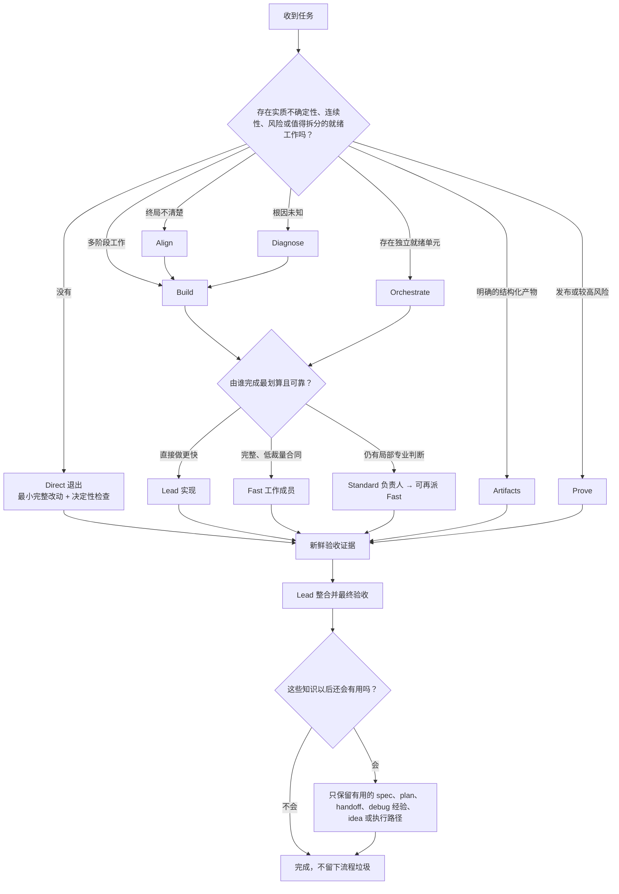
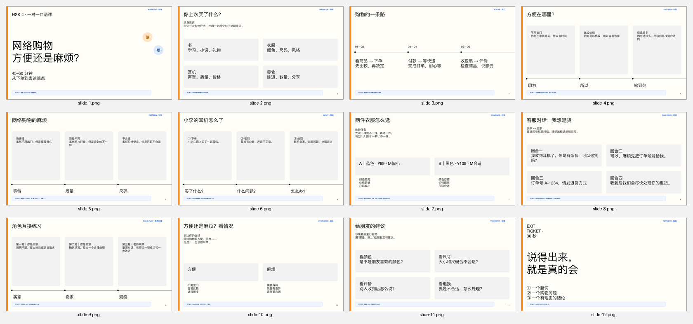

<p align="center">
  
</p>

<h1 align="center">Goldilocks</h1>

<p align="center"><strong>流程不过量，严谨不缺席，一切刚刚好。</strong></p>

<p align="center">
  <a href="README.md">English</a> · <a href="README.zh-CN.md">简体中文</a>
</p>

<p align="center">
  
  
  <a href="https://skills.sh/blackstone2333/goldilocks/goldilocks"></a>
  
</p>

Goldilocks 是一个精简、动态的 Superpowers 替代方案。头脑风暴、spec、plan、TDD、debug、连续性、委派、审查、验收和新想法留存等质量保障能力都还在，但只对外显示一个 Skill。

> 只使用足以维持质量、安全、授权和验收底线的流程。

清晰任务保持 Direct；只有出现具体触发条件才增加结构。Lead 模型把稀缺上下文用在理解意图、架构、整合和最终验收上，把完整、可独立验证的执行合同交给更便宜的工作模型。

## 它能做什么

| 内部引擎 | 何时启用 | 结果 |
|---|---|---|
| **Align** | 终局、产品选择、权限或验收存在实质不确定性 | 开工前形成紧凑决策或 spec |
| **Diagnose** | 已知有故障，但原因未知 | 复现、定位根因、聚焦修复、回归证据 |
| **Build** | 需要复用判断、持久计划、分阶段执行或有意识的 TDD | 最小必要计划和连贯执行单元 |
| **Orchestrate** | worktree、独立单元、委派、并行或模型路由能改善交付 | 就绪依赖图和边界清晰的工作合同 |
| **Prove** | 审查、发布、安全、集成或多个重要声明需要证据 | 与风险相称的新鲜检查和 Lead 验收 |
| **Evolve** | 出现有价值的新想法、可复用路径或 Skill 改进 | 留存后续方向或已验证经验，不扩大当前范围 |
| **Artifacts** | 用户明确要求制作多单元结构化产物 | 一个 Artifact Contract、可替换单元、单一集成负责人和全局 QA |

这是一套完整能力面，不是七个公开 Skill。唯一的 `goldilocks` 路由器只加载当前需要的内部引擎；事实跨越边界时才增加第二个。

## 它如何判断



不变的是最终质量，而不是流程数量，也不是谁亲手写代码。Goldilocks 不会因为工具箱里有 spec、plan、worktree、子智能体或连续性文档，就强行创建它们。

## 默认 Direct

根路由器不到 300 词。如果没有实质决策、未知根因、连续性需求、外部风险或值得委派的就绪工作，Goldilocks 会在加载任何工作流参考前直接退出。它只检查任务本地事实，完成最小完整改动，并运行一项“结果有错就会失败”的最小检查。

现有 Hook 会加入一条精简沟通约束，理念来自 Caveman 和 i-have-adhd（ADHD）：结果先行、省略开工前言、只报告状态变化、日志只留决定性片段；涉及安全、歧义或用户明确要求详细说明时恢复完整解释。它减少叙述噪声，不会让模型模仿原始人说话，也不会删掉必要证据。

## 修复过程不再是黑盒

修复故障后，Goldilocks 会分别说明三项内容：有证据支持的原因——仍无法确定时明确说明未知——采取的修复，以及新鲜验证结果。该例外同时约束 Lead 和被委派的工作模型，精简输出不能再隐藏“为什么要这样改”。用户随时可以继续要求详细解释根因、触发条件、修复原理或验证方法。

## 连续性，但不滥造文档

Direct 默认不创建流程文档，但当文档本身是交付物或正确性确实需要时，模型仍可自主建文档。只有任务需要跨越上下文压缩、多阶段、等待、用户中途引导、委派或交接时，才启用持久状态。

需要时，Goldilocks 使用清爽、方便人类和其他 Agent 接手的项目记忆：

```text
docs/
├── PROJECT.md          # 项目地图和稳定结构
├── work/               # 当前 spec、plan、工作包和 handoff
├── debug/              # 可复发 bug、根因、解法和回归链接
├── ideas.md            # 当前范围之外的好想法
└── CHANGELOG.md        # 用户可见变化
.goldilocks/
└── ACTIVE.md           # 上下文恢复用的紧凑执行前沿
```

`ACTIVE.md` 记录已完成工作、精确下一步、待处理或已消费的用户引导、仓库证据、验收情况和“不要重复”边界。上下文压缩后，以仓库状态为准，不以过期记忆为准。相似任务可以复用已验证执行路径，但必须先检查失效条件。

## 公司式动态编排

Goldilocks 把委派视为经济决策和组织决策：

- **Lead** 负责用户意图、架构、共享决策、冲突处理、整合和最终验收。
- **Standard** 负责仍需判断的有界领域，并可把判断转化成 Fast 合同。
- **Fast** 接收包含范围、权限、输入、接口、验收和返回证据的完整合同；Fast 是叶子成员。

Fast 指拆解后剩余裁量低，不代表原任务很小。多个独立就绪单元可以并行；不可分割的核心仍由 Lead 处理。并发数量取决于依赖、宿主容量、隔离条件、集成风险和审核吞吐，而不是僵硬的项目规模分级。

### Codex 模型路由

**编程 → Spark · 通用非编程 → Luna**

- Fast **编程** 默认先考虑 `gpt-5.3-codex-spark`，尤其适合利用 Codex 独立计量通道降低机会成本。
- Fast **通用非编程** 默认先考虑 `gpt-5.6-luna`，用于边界明确的文案、摘要、内容单元等。
- Standard 和 Lead 选择能越过任务质量底线的最佳可用模型；同类项目的本地证据优先于种子表。

Goldilocks 优先使用宿主明确支持的原生模型。当原生协作接口没有 Spark 或 Luna、但本地 Codex CLI 可以调用时，`dispatch_codex_worker.py` 会通过 `codex exec` 使用指定模型和完整合同。默认 `project` 档位保留仓库规则，同时隔离无关的全局插件、App、MCP、Skill 和 Hook；合同明确需要用户能力时可以选择 `inherit`。Fast 被关闭的是继续分派权，不是普通执行工具。

只有验证过的路由才会开始委派。路由启动失败时，立即回到 Direct 或另一条已验证路径，不在产品任务中消耗 Lead 回合调试工作模型的传输层。子任务事件流可留在 Lead 上下文之外，只向上汇报简洁证据。

目标不是不惜代价压低原始 token。质量和权限是硬门槛，总 token 必须受控；在合格路径之间，再尽量降低高倍率模型额度和关键路径时间。

初始模型种子只供参考，不是永久排行榜：

| 角色 | 起始候选 | 边界 |
|---|---|---|
| Fast 编程 | GPT-5.3-Codex-Spark、Muse Spark、GLM 及其他已验证低成本编程模型 | 完整合同、确定性验收、无共享决策 |
| Fast 通用 | GPT-5.6 Luna 及其他已验证通用生产模型 | 边界明确的内容单元，不负责最终编辑或视觉判断 |
| Standard | GPT-5.6 Terra、Grok、Claude Sonnet、Gemini Pro、GLM/Qwen 候选 | 有界领域判断和局部整合 |
| Lead | 当前宿主 Lead 模型，如 GPT-5.6 Sol、Claude Opus/Fable 及其他已验证前沿模型 | 意图、架构、关键决策和组合验收 |

模型可用性、工具、隐私、语言、模态和任务质量底线都是硬门槛；同项目同任务形态的近期结果优先于公开排名。参见[机器可读种子表](plugins/goldilocks/skills/goldilocks/assets/model-registry.json)和[带日期的方法说明](docs/model-routing-survey-2026-07-18.md)。

## 结构化 Artifacts

Goldilocks 可以组织 PPT 等明确的多单元产物，但不会假装替代专业的 PPT、文档、表格或视频 Skill。

1. Lead 冻结全局 **Artifact Contract**：受众、目标、结构、共享设计/数据规则、依赖、整合和验收。
2. 可替换单元获得边界合同，并可使用相应专业 Skill 制作。
3. 各单元独立检查，失败单元执行 **localized rework**。
4. 单一集成负责人组装正式产物并执行全局 QA。

**单元边界用于控制局部返工**；它不意味着每页 PPT 或每个章节都要新开一个 Agent。兼容单元可以共用工作会话，以摊薄启动和上下文成本。

仓库里的 12 页 HSK4 一对一课程是架构样例：

<p align="center">
  
</p>

参见 [Artifacts 设计](docs/v0.4-structured-artifact-orchestration.zh-CN.md)和[试制证据](evals/results/2026-07-25-v040-structured-artifact-pilot.md)。

## 证据

### v0.4.1 Direct 路径认证

测试使用全新仓库、模型不可见的固定外部验收、Direct/Goldilocks 同波并行、排除预热，并由 GPT-5.6 Sol high 完成简单、中度、复杂三种编程任务。

| 场景 | 每组次数 | 每组验收 | 中位耗时 | 中位官方 API 成本 | 中位处理 token |
|---|---:|---:|---:|---:|---:|
| 简单 | 3 | 9/9 | **−2.6%** | **−24.3%** | **−13.8%** |
| 中度 | 5 | 60/60 | **−30.1%** | **−13.6%** | **−20.4%** |
| 复杂 | 3 | 45/45 | **−4.2%** | **−4.9%** | **−14.5%** |

每组共 11 次运行，两条路径都通过 **114/114** 项外部检查。Goldilocks 累计耗时低 10.9%，按 GPT-5.6 Sol Standard 官方 token 价格计算的成本低 6.3%，处理 token 低 11.5%。这证明当前 Direct 分支在这些任务上有效；发现需求、debug、长期连续性和委派仍需要更多真实项目反馈。参见[报告和机器可读数据](evals/results/2026-07-26-v041-direct-depth-ab.md)。

### Goldilocks 对 Superpowers

Goldilocks 只提出一个克制的公开结论：在已测试工作流表面上，它是更好的 Superpowers 替代方案。

| 测试 | Goldilocks | Superpowers | 结果 |
|---|---:|---:|---|
| 8 场景指令压力测试 | **98.9/100** | 79.2/100 | Goldilocks 领先 8/8，规则文本少 86.2% |
| Three Bears 成功交付 | **27/27** | 8/27 | Goldilocks 保持 100% 实测安全 |
| 每次成功交付总 token | **112,285** | 289,333 | Goldilocks −61.2% |
| 每次成功交付耗时 | **143.2 秒** | 361.3 秒 | Goldilocks −60.4% |
| 每次成功交付 Skill 活动 | **1.1** | 10.9 | Goldilocks −89.8% |

在双方都成功的 8 个完全相同单元里，Goldilocks 总 token 少 30.6%、耗时少 7.7%、工具调用少 28.6%、Skill 活动少 66.7%。参见[完整正面对照报告](benchmarks/GOLDILOCKS-VS-SUPERPOWERS.zh-CN.md)和[公开数据](benchmarks/three_bears/results/data/2026-07-18-terra-low-full/head-to-head.json)。

这些结果支持用 Goldilocks 替换 Superpowers，但不能证明它在所有工作流、模型、仓库或供应商上都绝对领先。欢迎继续做项目测试并反馈。

## 安装

不要同时启用 Goldilocks 和 Superpowers。

### 任意兼容 Skills 的 Agent

```bash
npx skills add blackstone2333/goldilocks
```

全局安装为 Codex Skill：

```bash
npx skills add blackstone2333/goldilocks --skill goldilocks --global --agent codex --yes
```

安装器支持时，可把 `codex` 换成 `claude-code`、`cursor`、`opencode`、`github-copilot` 或 `gemini-cli`。

### Codex 原生插件

```bash
codex plugin marketplace add blackstone2333/goldilocks
codex plugin add goldilocks@goldilocks-local
```

### Claude Code 原生插件

```bash
claude plugin marketplace add blackstone2333/goldilocks
claude plugin install goldilocks@goldilocks
```

项目级安装、更新和卸载方法见[完整安装说明](docs/installation.zh-CN.md)。

## 更新

仓库和 skills.sh 安装都以 GitHub 为源，但不会静默改写本地正在使用的副本；发布新版本后，需要重新运行对应安装或升级命令。Codex 原生插件每天最多静默检查一次 GitHub：已是最新版或离线时不提示；发现新版本时只提醒一次；未经同意不会自动更新。设置 `GOLDILOCKS_UPDATE_CHECK=0` 可关闭检查。

## 当前状态

Goldilocks 仍是实验版 `v0.4.2`。它能够更好地替代 Superpowers，但并非在所有可能的工作流程中都有绝对优势，因此需要更多项目的测试和反馈，[欢迎提出意见](https://github.com/blackstone2333/goldilocks/issues)。

Goldilocks 采用 MIT 许可证，由 Charles Roc 和贡献者开发。它是独立实现，受到 Superpowers、Grill 式决策前沿提问、Ponytail 原生/复用优先理念、Caveman 和 ADHD 的启发；这些项目并未为 Goldilocks 背书。详见[第三方声明](plugins/goldilocks/THIRD_PARTY_NOTICES.md)。
