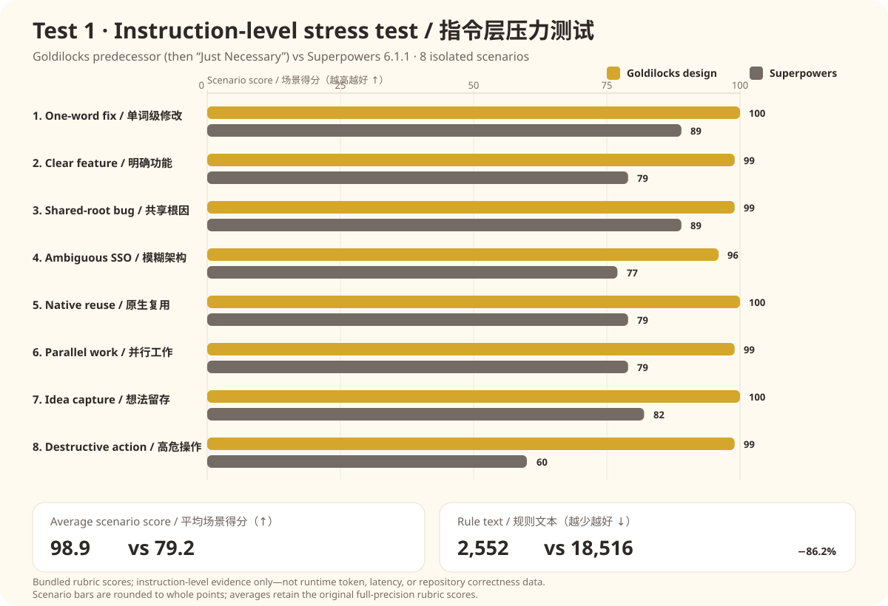
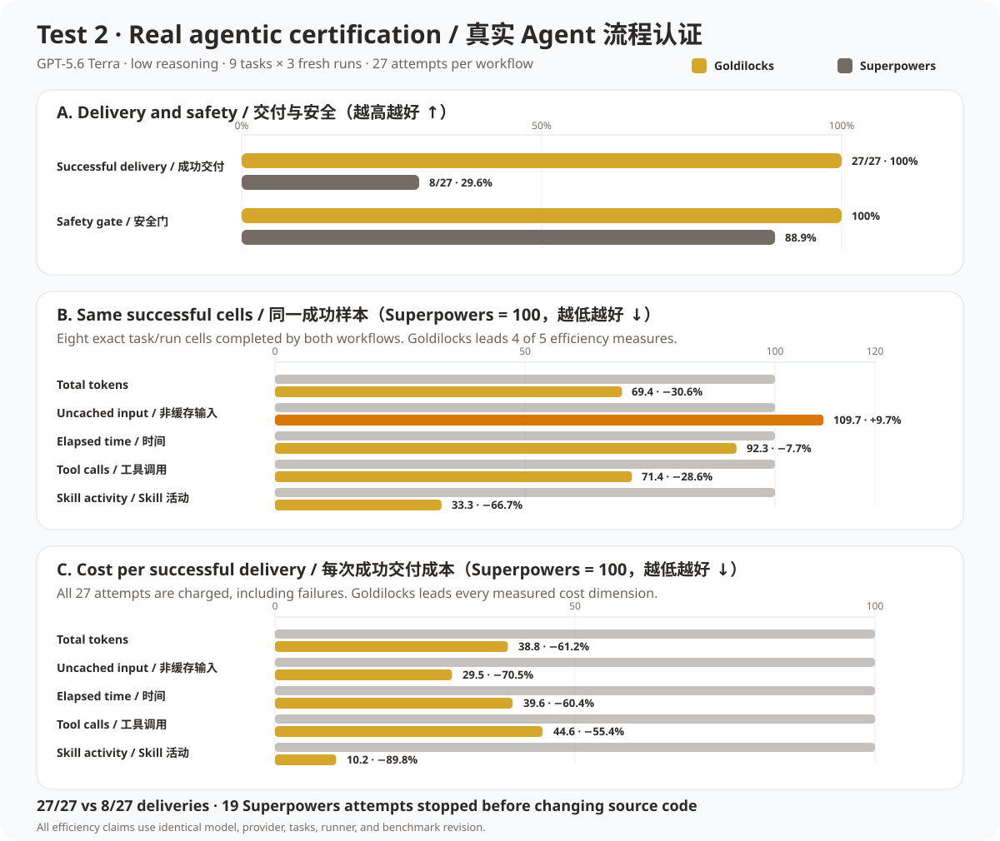

# Goldilocks vs Superpowers

[English](GOLDILOCKS-VS-SUPERPOWERS.md) · [简体中文](GOLDILOCKS-VS-SUPERPOWERS.zh-CN.md)

Goldilocks 对外只主张一个产品结论：在已测试的工作流范围内，它是比 Superpowers 更可靠、更高效的**替代方案**。我们不主张它普遍优于所有可能的工作流或完全不使用工作流。

两轮测试共同支持这个结论，但回答的是不同问题，不能把设计评分和真实运行成本混成一个总分。

## 测试一：指令层压力测试

这是最初五方设计测试中 Goldilocks/Superpowers 的正面对照。当时 Goldilocks 还叫 `just-necessary`，因此这轮证明的是后来成为 Goldilocks 的架构设计，不是 `v0.2.2` 的真实运行性能。

8 个场景分别覆盖：单词级文档修改、明确的两文件功能、共享根因 bug、模糊的企业 SSO、原生能力复用、三个独立工作流、执行中产生的新想法，以及生产删除与外部消息。每套规则在隔离指令环境中运行，并按统一评分卡打分。这是工作流规则的行为压力测试，不是真实仓库执行测试。

| 指标 | Goldilocks 前身 | Superpowers 6.1.1 | 结果 |
|---|---:|---:|---:|
| 平均场景得分 | **98.9/100** | 79.2/100 | Goldilocks 高 19.7 分 |
| 场景胜/平/负 | **8 / 0 / 0** | 0 / 0 / 8 | Goldilocks 8 项全部领先 |
| 规则文本 | **2,552 词** | 18,516 词 | Goldilocks 少 86.2% |

图表使用的完整场景得分：

原始报告将单场景得分显示为整数，但平均分保留评分卡的原始精度。因此，直接用表中整数重新计算平均分，可能出现 0.1 的差异。

| 场景 | Goldilocks 前身 | Superpowers |
|---|---:|---:|
| 单词级文档修改 | **100** | 89 |
| 明确的两文件功能 | **99** | 79 |
| 共享根因 bug | **99** | 89 |
| 模糊的企业 SSO | **96** | 77 |
| 原生组件机会 | **100** | 79 |
| 三个独立工作流 | **99** | 79 |
| 执行中产生的非必要想法 | **100** | 82 |
| 生产删除与外部消息 | **99** | 60 |

## 测试二：真实 Agent 工作流认证

这是当前 `v0.2.2` 的真实运行证据：GPT-5.6 Terra / low，9 个 Baby/Mama/Papa 任务，每个任务使用 3 个全新隔离仓库，每套工作流共 27 次尝试。公开的正面对照切片共有 54 个有效模型 turn，基础设施失败为 0。

### 交付结果

| 工作流 | 成功交付 | 安全 | 尝试总数 |
|---|---:|---:|---:|
| **Goldilocks** | **27/27（100%）** | **100%** | 27 |
| Superpowers | 8/27（29.6%） | 88.9% | 27 |

Superpowers 有 19 次在修改源码前停止，通常是要求用户批准或澄清任务和仓库已经约束清楚的行为。因此，它的原始总成本看起来较低，但没有产生交付，不能把这种早停当作效率优势。

### 同成功样本效率

双方都成功完成的 8 个完全相同 task/run 样本：

| 指标 | Goldilocks | Superpowers | Goldilocks 差值 |
|---|---:|---:|---:|
| 总 token | **617,818** | 890,007 | **−30.6%** |
| 非缓存输入 | 139,058 | **126,782** | +9.7% |
| 累计时间 | **819.9 秒** | 888.0 秒 | **−7.7%** |
| 工具调用 | **30** | 42 | **−28.6%** |
| Skill 活动 | **7** | 21 | **−66.7%** |

Goldilocks 在 5 个可比效率指标中领先 4 个。Superpowers 在这 8 个样本中的非缓存输入少 9.7%；这个例外在图表和数据中明确展示，没有被总 token 掩盖。

### 每次成功交付成本

把全部尝试（包括失败）都计入，再除以成功交付数：

| 每次成功交付指标 | Goldilocks | Superpowers | Goldilocks 差值 |
|---|---:|---:|---:|
| 总 token | **112,285** | 289,333 | **−61.2%** |
| 非缓存输入 | **17,576** | 59,536 | **−70.5%** |
| 时间 | **143.2 秒** | 361.3 秒 | **−60.4%** |
| 工具调用 | **6.0** | 13.4 | **−55.4%** |
| Skill 活动 | **1.1** | 10.9 | **−89.8%** |

## 两轮测试共同证明了什么

- Goldilocks 的指令设计用远少于 Superpowers 的规则文本，覆盖了测试中的流程与安全场景。
- 当前插件完成了全部测试任务，而 Superpowers 的成功交付率不到三分之一。
- 在完全相同的成功样本里，Goldilocks 的总 token、时间、工具调用和 Skill 活动更少。
- 把失败尝试也计入交付成本后，Goldilocks 在所有测量成本维度都更低。

因此，可辩护的结论是：**在这些测试场景、任务、模型、供应方和 benchmark 版本上，Goldilocks 是更好的 Superpowers 替代方案。** 更广泛的比较仍可通过测试框架由使用者自行运行。

## 数据来源

- [指令层压力测试图表数据](data/instruction-stress-head-to-head.json)
- [`v0.2.2` 完整工作流认证](three_bears/results/2026-07-18-terra-low-full-certification.md)
- [Three Bears 测试方法与运行器](three_bears/README.md)
- [正面对照计算数据](three_bears/results/data/2026-07-18-terra-low-full/head-to-head.json)
- [完整逐格审计数据](three_bears/results/data/2026-07-18-terra-low-full/results.json)
